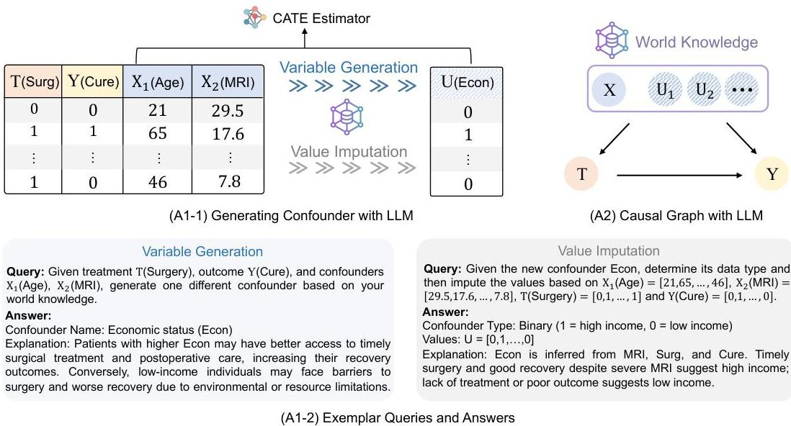
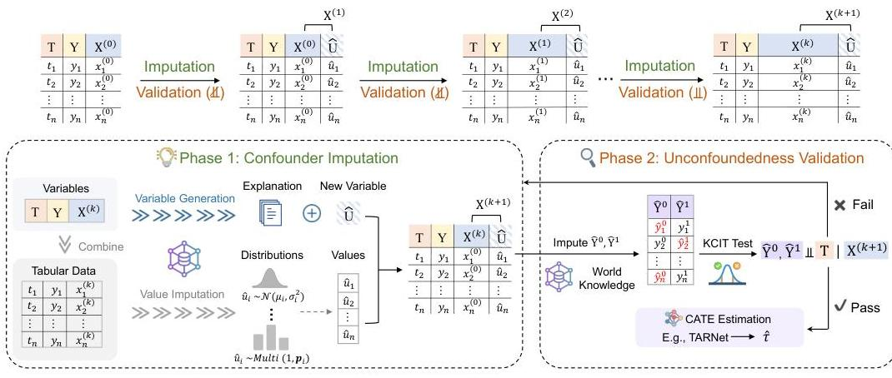
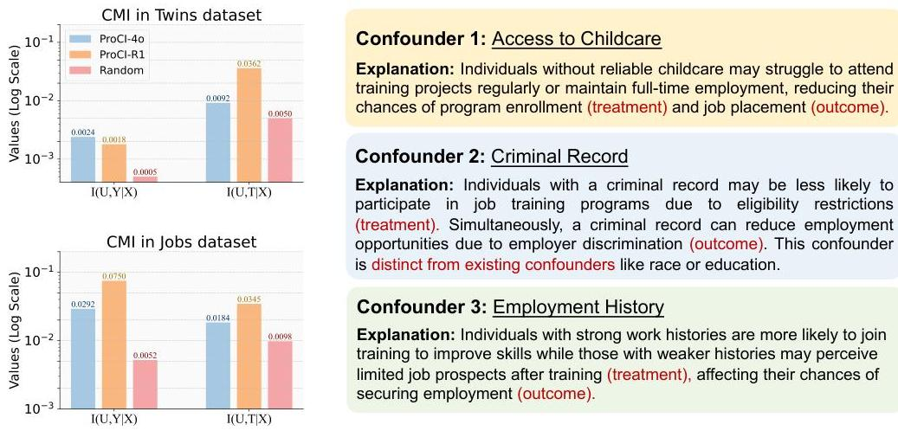
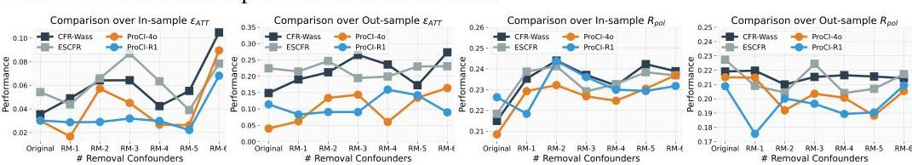
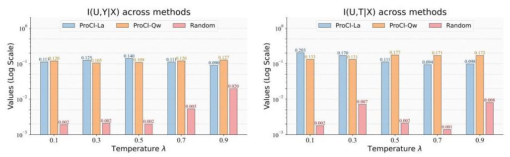

> *本文档由 Paper Burner 工具制作 (2025-10-09)。内容由 AI 大模型翻译生成，不保证翻译内容的准确性和完整性。*

# 通过大型语言模型进行渐进式混杂因素插补以缓解隐藏混杂

Hao Yang ${ }^{1}$ Haoxuan $\mathbf{Li}^{2}$ Luyu Chen ${ }^{1}$ Haoxiang Wang ${ }^{3}$ Xu Chen ${ }^{1 *}$ Mingming Gong ${ }^{2 *}$ ${ }^{1}$ 中国人民大学高瓴人工智能学院 ${ }^{2}$ 北京大学数据科学中心 ${ }^{3}$ 北京大学数学科学学院 ${ }^{4}$ 穆罕默德·本·扎耶德人工智能大学机器学习系 hao.yang@ruc.edu.cn, hxli@stu.pku.edu.cn, luyu.chen@ruc.edu.cn, whxwhx@pku.edu.cn, xu.chen@ruc.edu.cn, mingming.gong@unimelb.edu.au

#### 摘要

隐藏混杂在从观察数据估计处理效应时仍然是一个核心挑战，因为未观测变量可能导致因果估计偏差。尽管近期工作已经探索了使用大型语言模型（LLMs）进行因果推断，但大多数方法仍然依赖于无混杂性假设。在本文中，我们首次尝试使用LLMs来缓解隐藏混杂。我们提出了ProCI（渐进式混杂因素插补），一个利用LLMs的语义和世界知识来迭代生成、插补和验证隐藏混杂因素的框架。ProCI利用了LLMs的两个关键能力：强大的语义推理能力，使其能够从结构化和非结构化输入中发现合理的混杂因素；以及其内置的世界知识，支持在潜在混杂情况下的反事实推理。为了提高鲁棒性，ProCI采用分布推理策略而非直接值插补，以防止输出崩溃。大量实验表明，ProCI能够发现有意义的混杂因素，并在各种数据集和LLMs上显著改善处理效应估计。

## 1 引言

从观察数据估计处理效应是因果推断中的一个核心问题，在医疗保健[40, 16]、社会科学[14]和经济学[49, 47]中有广泛应用。与随机对照试验（RCTs）不同，观察研究中处理组和对照组之间的非随机处理分配可能导致组间混杂因素不平衡，这被认为是非因果间接关联的主要贡献因素[37]。由不平衡混杂因素引起的偏差被称为混杂偏差[46, 51]。

为了从观察数据中以无偏方式估计处理效应，近期进展主要集中于基于表示的方法，这些方法旨在平衡处理组和对照组之间的潜在分布[46, 51, 6, 56]。最近，随着大型语言模型（LLMs）展现出推理和知识理解的卓越能力，大量工作已开始探索它们在处理效应估计中的潜力[35, 22, 26, 18, 23]。例如，[26]使用思维链推理提示LLMs生成支持因果结论的自然语言理由，而[23]利用LLMs对高维文本处理进行编码，以进行处理效应估计同时缓解混杂。

[^0]预印本。审稿中。

[^0]:    *通讯作者。

然而，现有方法，包括那些基于LLMs的方法，大多依赖于无混杂性假设[37]，该假设认为所有影响处理和结果的混杂因素都被观测到了。在现实环境中，这个假设通常不切实际，因为重要因素可能未被观测到或完全未被记录[5]。例如，在医疗保健领域，治疗决策可能不仅受测试结果或年龄等观察到的临床特征的影响，还受社会经济地位等未观测因素的影响，如果省略这些因素，它们可能成为混杂因素。为了解决隐藏混杂问题，先前的工作已经探索了三个主要方向。敏感性分析旨在通过对处理效应推导界限来量化隐藏混杂的影响[43, 42]，但通常依赖于关于混杂机制的固定且不可测试的假设[12, 50]。辅助变量方法，包括工具变量和前门调整，使用外部信息或中间路径来恢复无偏估计[30, 13, 45]，但依赖于很少可验证的强结构假设[24, 53, 7]。RCT整合方法结合随机和观察数据来纠正隐藏混杂偏差[27, 19, 55]，但RCT的高成本和有限可用性经常限制它们的实际效用。

为了填补这一空白，我们首次尝试利用LLMs来缓解处理效应估计中的隐藏混杂。与传统方法相比，LLMs提供两个关键优势。首先，LLMs具有强大的语义推理能力，使它们能够解释结构化协变量和非结构化文本描述，从而发现数据中未明确记录的合理混杂因素。其次，LLMs嵌入了从大规模语料库中学到的广泛世界知识，这些知识隐含地捕获了广泛的潜在混杂因素，使它们即使在存在隐藏混杂的情况下也能支持反事实推理。

为了在实践中激发这些能力，我们提出了ProCI（渐进式混杂因素插补），这是一个利用LLMs迭代发现和调整隐藏混杂因素的新框架。ProCI在两个阶段之间交替进行：(1)混杂因素插补，其中提示LLM基于观测变量的语义生成一个合理的缺失混杂因素，并插补其具体值；(2)无混杂性验证，该验证基于LLM的反事实推理能力——通过提示LLM插补缺失的潜在结果，我们实证测试生成的混杂因素是否恢复了处理和结果之间的条件独立性。ProCI采用分布推理策略而非直接预测值（我们实证发现直接预测值会导致输出崩溃或不一致）：它首先从LLM中根据其世界知识引出最合理的分布类型，然后推断分布参数以生成多样、真实的样本。这个渐进过程持续进行，直到生成的混杂因素通过独立性测试，表明隐藏混杂的主要来源已被缓解。通过将LLMs纳入处理效应估计流程，ProCI为缓解观察研究中的隐藏混杂提供了一个灵活且可扩展的解决方案。我们的贡献可以总结如下：

- 据我们所知，这是第一个利用LLMs来缓解处理效应估计中隐藏混杂的工作。这是通过引出观察数据中的语义信号和LLMs中嵌入的隐含混杂知识实现的。
- 我们提出了ProCI，一个通过联合利用文本描述和结构化协变量来促使LLMs生成和插补合理混杂因素的渐进框架。生成混杂因素的充分性通过基于LLM的反事实预测和条件独立性的实证测试来验证。

- 在多样化的数据集和多种 LLM 架构上进行的大量实验证明了我们方法的有效性和普适性，在揭示隐藏混杂因素和估计处理效应方面表现出更优的性能。

# 2 预备知识 

### 2.1 问题设置

我们考虑二元处理效应估计中的标准设置 ${ }^{2}$。令 $T \in\{0,1\}$ 表示一个二元处理分配，其中 $T=1$ 表示接受处理，$T=0$ 表示控制组。令 $Y \in \mathbb{R}$ 为观测结果，$X \in \mathcal{X}$ 为观测协变量。该

[^0]
[^0]:    ${ }^{2}$ 为了清晰起见，我们主要关注二元处理场景，但本文提出的方法可以直接扩展到其他场景，例如多值或连续处理。

观测数据集由独立同分布样本 $\left\{\left(x_{i}, t_{i}, y_{i}\right)\right\}_{i=1}^{n} \sim \mathcal{D}$ 组成。在潜在结果框架 [44] 下，每个单位都与两个潜在结果相关联：$Y^{1}$ 和 $Y^{0}$，分别表示该单位在接受处理和控制条件下会得到的结果。在实践中，每个单位只能观测到一个事实结果 $Y$，其值取决于所分配的处理。个体层面的处理效应定义为：

$$
\tau(x)=\mathbb{E}\left[Y^{1}-Y^{0} \mid X=x\right]
$$

这通常被称为条件平均处理效应 (Conditional Average Treatment Effect, CATE) [2]。它量化了给定协变量配置 $x$ 下潜在结果的期望差异，并作为个体层面处理效应估计中我们感兴趣的主要待估量。

# 2.2 可识别性假设 

从观测数据中估计 CATE 需要一组可识别性假设 [37]。这些假设包括一致性假设，即观测结果与接受处理后的潜在结果相对应，且单位之间无干扰；以及正性假设，该假设确保对于所有协变量值，接受任何处理的概率都严格为正。本文重点关注无混杂性假设，我们将其正式定义如下：
假设 1 (无混杂性)。在给定观测协变量的条件下，处理分配与潜在结果独立，即，

$$
\left(Y^{1}, Y^{0}\right) \Perp T \mid X
$$

当这些假设成立时，公式 (1) 中的 CATE 函数变得可识别，并表示为：

$$
\tau(x)=\mathbb{E}[Y \mid T=1, X=x]-\mathbb{E}[Y \mid T=0, X=x]
$$

这可以通过学习一个估计器 $\hat{\tau}(x)$（例如，使用 CFRNet 或 TARNet [46]）来直接从有限的观测数据集 $\mathcal{D}$ 中估计，该估计器用于逼近真实的 CATE 函数 $\tau(x)$。
隐藏混杂挑战。然而，在实践中，由于背景信息有限 [25]，无混杂性假设很容易被违反，即观测协变量 $X$ 未能捕捉到所有共同影响处理和结果的相关混杂因素。具体而言，处理分配可能依赖于隐藏变量 $U$，而 $U$ 同时也影响结果 $Y$。在这种情况下，条件独立性假设 $\left(Y^{1}, Y^{0}\right) \Perp T \mid X$ 不再成立，取而代之的是 $\left(Y^{1}, Y^{0}\right) \not \models T \mid X$，但如果 $U$ 也被观测到，则可能满足 $\left(Y^{1}, Y^{0}\right) \Perp T \mid(X, U)$。这种隐藏混杂导致了系统性估计偏差：学习到的估计器 $\hat{\tau}(x)$（假设在给定 $X$ 的条件下无混杂）相对于真实的 CATE $\tau(x)$ 是有偏的。

## 3 提出的 ProCI 框架

### 3.1 动机

如前所述，隐藏混杂是观察性研究中的一个根本性挑战，因为它会严重偏倚处理效应的估计。尽管已经提出了一系列方法来缓解此问题，包括使用辅助变量、敏感性分析以及来自随机对照试验 (RCT) 的数据，但这些方法要么依赖于不可检验的假设，要么在实践中应用成本过高 [5]。
受限于这些方法的不足，我们提出了一个通过 LLM 解决隐藏混杂问题的新范式。利用其独特的能力，本文首次尝试直接使用 LLM 来缓解隐藏混杂，这基于两大关键优势：

- 优势 1：超越表格数据的语义利用。传统方法通常依赖于结构化表格数据和预定义的变量集，难以发现未被明确记录的缺失混杂因素。相反，如图 1 (A1-1) 和 (A1-2) 所示，LLM 可以通过解释处理、结果和观测协变量之间的语义关系来生成有意义的混杂因素候选。这展示了 LLM 利用编码在语言中的领域级先验知识来推理合理潜在变量的能力。随后，通过利用现有的表格数据，LLM 可以基于其上下文推理能力执行个体层面的混杂因素填补以完成缺失数据。

图 1：LLM 如何帮助缓解隐藏混杂的示意图。(A1-1) LLM 接收结构化数据（处理 $T$、结果 $Y$、协变量 $X$）以生成一个缺失的混杂因素，并为其填补个体层面的值用于 CATE 估计。(A1-2) 提示和响应示例展示了 LLM 如何利用语义和世界知识进行变量生成和值填补。(A2) 从因果角度看，LLM 将潜在混杂因素嵌入其世界知识中，使得无需显式访问它们即可进行反事实推理。

- 优势 2：通过世界知识实现的隐式混杂感知。除了显式生成混杂因素外，LLM 内在地编码了丰富的世界知识，这些知识隐式地捕捉了因果依赖关系和潜在的混杂因素。如图 1 (A2) 所示，这种嵌入的知识使得 LLM 能够逼近隐藏变量的影响，从而支持反事实推理，而无需直接访问所有混杂因素。这种隐式感知使 LLM 特别适用于收集完整因果信息不切实际的场景，为传统方法提供了一种可扩展且假设更少的替代方案。随着真实世界数据的复杂性和维度不断增长，这一优势变得越来越有价值。

# 3.2 ProCI框架概述

为了激发LLM的上述能力以实际应用，我们提出了ProCI，一个用于缓解观察数据中隐藏混杂因素的框架。如图2所示，ProCI包含两个迭代阶段：混杂因素插补和无混杂性验证。

阶段1：混杂因素插补。给定观测数据集$\left\{X^{(0)}, T, Y\right\}$，其中$X^{(0)}$包含结构化协变量，ProCI首先提示LLM基于$X^{(k)}, T$和$Y$之间的语义关系生成一个合理的混杂变量$\hat{U}$。LLM还为生成的变量提供文本解释。接下来，该框架通过确定$\hat{U}$的分布类型并使用LLM引导的推理估计相应参数，来为$\hat{U}$插补实例级值。然后将插补的混杂因素附加到数据集中以形成$X^{(k+1)}$。

阶段2：无混杂性验证。为了评估生成的混杂因素$\hat{U}$是否捕获了足够的隐藏偏差，ProCI执行基于插补的经验性无混杂性测试。具体而言，由于LLM在其世界知识表示中编码了隐藏的混杂信息，ProCI利用这一能力来插补反事实结果$\hat{Y}^{0}$和$\hat{Y}^{1}$。然后，应用基于核的条件独立性检验（KCIT）来检查$\left(\hat{Y}^{0}, \hat{Y}^{1}\right) \Perp T \mid X^{(k+1)}$。如果测试失败，ProCI返回阶段1以生成额外的混杂因素。如果测试通过，框架继续使用任何标准估计器（如TARNet）估计CATE。

通过逐步生成和验证混杂因素，ProCI自适应地构建了一个充分的调整集，而无需访问真实混杂变量，从而在存在隐藏混杂偏差的情况下实现更可靠的处理效果估计。

图2：ProCI框架概述。ProCI在两个阶段之间交替进行：(1) 混杂因素插补，其中LLM基于当前变量生成新的混杂因素并插补其实例级值。(2) 无混杂性验证，其中插补反事实结果并应用KCIT来评估无混杂性是否成立。该过程重复直到测试通过，之后可以使用任何标准估计器进行最终的CATE估计。

### 3.3 通过提示LLM进行混杂因素插补

在本节中，我们建议提示LLM生成在语义上合理且因果相关的隐藏混杂因素。插补混杂因素涉及两个关键步骤：(1) 生成具有有意义的文本描述的变量，(2) 为数据集中的每个个体插补其具体值。我们在下面详细描述这些步骤。

**变量生成。** 给定一个由观测变量$\{X, T, Y\}$组成的数据集$\mathcal{D}_{\text{obs}}$，其中$X$表示协变量，$T$表示处理，$Y$表示结果，我们首先设计一个提示函数$\mathcal{P}_{\text{var}}$，将这些变量的文本描述转换为自然语言查询。然后，我们使用此提示查询LLM，以获得与$T$和$Y$语义相关且与$X$正交的候选混杂变量$\hat{U}$：

$$
\hat{U}, \hat{U}_{\text{exp}} = \text{LLM}(\mathcal{P}_{\text{var}}(X, T, Y)),
\tag{4}
$$

其中$\hat{U}$是生成的混杂因素的名称或描述，$\hat{U}_{\text{exp}}$是LLM提供的附随自然语言解释。此解释增强了生成过程的可解释性，并可作为$\hat{U}$语义合理性的支持证据。

**值插补。** 生成混杂变量$\hat{U}$后，我们接下来为每个个体插补其值，以获得增强的数据集$\hat{\mathcal{D}}_{\text{obs}} = \{x_i, t_i, y_i, \hat{u}_i\}_{i=1}^N$。直接值插补，即提示LLM通过单次查询为每个个体生成$\hat{u}_i$，往往会产生坍缩输出，其中许多个体获得相似或相同的值。为了解决这个问题，我们将值插补分解为分布识别和参数推断，如下所示。

*分布识别。* 直观地说，通过利用其嵌入的常识和世界知识，LLM可以可靠地识别变量的分布类型，例如，推断身高遵循正态分布，而出生月份在社区中近似均匀分布。因此，对于生成的变量$\hat{U}$，我们可以有信心地提示LLM识别一个合理的分布类型$\mathcal{F} \in \mathbb{F} = \{\mathcal{F}_z\}_{z=1}^Z$：

$$
\mathcal{F} \sim \text{LLM}(\mathcal{P}_{\text{dist}}(X, T, Y, \hat{U})) \mid \mathcal{F} \in \mathbb{F}. \tag{5}
$$

在实践中，候选分布类型$\mathbb{F}$包括但不限于高斯分布、伯努利分布和分类分布。

*参数推断。* 一旦选择了分布族$\mathcal{F}$，我们提示LLM基于每个个体的观测特征推断个体特定的分布参数$\theta_i$。例如，如果$\mathcal{F}$是正态分布，则$\theta_i = (\mu_i, \sigma_i)$。然后，我们从相应的个性化分布中抽样插补值$\hat{u}_i$：

$$
\theta_i = \text{LLM}(\mathcal{P}_{\text{param}}(x_i, t_i, y_i)), \quad \hat{u}_i \sim \mathcal{F}(\theta_i). \tag{6}
$$

与直接值插补相比，这种分解策略有助于减少不确定性，并缓解LLM输出中经常观察到的坍缩效应，从而为混杂因素值生成提供了更稳健和可控的方式。

# 3.4 基于填补的经验无混杂性检验 

虽然大语言模型（LLMs）可以帮助填补混杂因素，但检验生成的混杂因素的有效性仍然具有挑战性。直观地说，一个关键标准是无混杂性假设（假设1）：一旦在观测到的和生成的混杂因素 $X$ 和 $\hat{U}$ 上进行条件化，处理变量 $T$ 应该与潜在结果 $Y^{0}$ 和 $Y^{1}$ 相互独立。然而，在观测性数据集中，我们只能为每个个体观测到这两个潜在结果中的一个，这使得对无混杂性假设的经验检验似乎是不可行的。
为了弥合这一差距，我们提出使用大语言模型按如下方式填补缺失的结果 $Y^{0}$ 和 $Y^{1}$：

$$
\hat{y}_{i}^{1-t_{i}}=\operatorname{LLM}\left(\mathcal{P}_{\text {out }}\left(x_{i}, u_{i}, t_{i}, y_{i}\right)\right)
$$

然后，我们构建变量 $\hat{Y}^{0}$ 和 $\hat{Y}^{1}$，其中对于每个个体 $i$ ：

$$
\hat{y}_{i}^{0}=\left(1-t_{i}\right) \cdot y_{i}+t_{i} \cdot \hat{y}_{i}^{1-t_{i}}, \quad \hat{y}_{i}^{1}=t_{i} \cdot y_{i}+\left(1-t_{i}\right) \cdot \hat{y}_{i}^{1-t_{i}}
$$

合理性分析。由于大语言模型嵌入了广泛的世界知识，这些知识可能涵盖了所有相关的隐藏混杂因素 $U^{*}$，因此在无混杂性假设下，它们可以被视为近似无偏的反事实估计器。也就是说，当以大语言模型可访问的全部上下文（包括结构化和非结构化信息）为条件时，潜在结果 $\left(Y^{0}, Y^{1}\right)$ 与处理 $T$ 变得相互独立。形式上，我们假设大语言模型隐式地以一个潜在变量 $U^{*}$ 为条件，使得 $\left(Y^{0}, Y^{1}\right) \Perp T \mid X, U^{*}$，其中 $U^{*}$ 表示编码在大语言模型先验知识中的一组充分的隐藏混杂因素。这支持了使用大语言模型进行反事实预测。

在获得填补的结果 $\hat{Y}^{0}$ 和 $\hat{Y}^{1}$ 后，我们可以使用非参数独立性检验来统计检验无混杂性假设。具体来说，我们采用基于核的条件独立性检验（KCIT），该方法非常适用于高维条件集 [39]。KCIT 评估在给定观测到的和生成的混杂因素 $X$ 和 $\hat{U}$ 的条件下，处理 $T$ 是否与填补的结果 $\left(\hat{Y}^{0}, \hat{Y}^{1}\right)$ 条件独立：

$$
\mathbb{I}\left(\operatorname{KCIT}\left(\left(\hat{Y}^{0}, \hat{Y}^{1}\right), T \mid X, \hat{U}\right)>\alpha\right)=1
$$

其中 $\operatorname{KCIT}(\cdot)$ 返回一个 $p$ 值，$\alpha$ 是一个预定义的显著性水平。指示函数 $\mathbb{I}(\cdot)$ 在条件独立性的原假设未被拒绝时输出 1，否则输出 0。
基于以下定理，我们确立了在条件独立性检验中使用填补的反事实结果和大语言模型生成的混杂因素的渐进有效性。
定理 1. 在关于核函数和填补分布类的标准正则条件下，应用于填补变量的 KCIT 满足：

$$
K C I T\left(\left(\hat{Y}^{0}, \hat{Y}^{1}\right), T \mid X, \hat{U}\right)=K C I T\left(\left(Y^{0}, Y^{1}\right), T \mid X, U\right)+o_{p}(1)
$$

其中 $o_{p}(1)$ 表示一个随着样本量增加而依概率收敛于零的项。请参阅附录以获取该定理的详细证明。

### 3.5 渐进式混杂因素填补过程

到目前为止，我们已经介绍了如何填补单个混杂因素并检验其有效性。然而，在现实世界的场景中，隐藏混杂通常源于多个因素，并可能涉及大量的潜在变量。例如，医疗保健中的处理分配可能受到人口统计因素、社会经济地位和行为特征组合的影响 [40, 16]，其中许多在实践中难以观测。
一种朴素的方法是同时生成多个混杂因素，但这通常会导致生成变量之间存在冗余或语义重叠。为了解决这个问题，我们提出了

表 1：在 Jobs 和 Twins 数据集上处理效应估计性能的总体比较。对于每个基础模型，我们高亮显示了各方法中的最佳结果。

| Datasets | Jobs | | | | Twins | | | |
| --- | --- | --- | --- | --- | --- | --- | --- | --- |
| Test Types | In-sample | | Out-sample | | In-sample | | Out-sample | |
| Methods | $\epsilon_{A T T}$ | $\overline{\mathcal{R}}_{p d}$ | $\epsilon_{A T T}$ | $\overline{\mathcal{R}}_{p d}$ | $\epsilon_{A T E}$ | $\epsilon_{F P E E}$ | $\epsilon_{A T E}$ | $\epsilon_{F P E E}$ |
| S-Learner | $0.0491_{\pm 0.0011}$ | $0.2288_{\pm 0.0008}$ | $0.0876_{\pm 0.0018}$ | $0.1678_{\pm 0.0002}$ | $0.0131_{\pm 0.0020}$ | $0.2527_{\pm 0.0011}$ | $0.0037_{\pm 0.0024}$ | $0.2819_{\pm 0.0001}$ |
| +ProCI-4o | $0.0793_{\pm 0.0047}$ | $0.2288_{\pm 0.0001}$ | $0.0833_{\pm 0.0001}$ | $0.1667_{\pm 0.0014}$ | $0.0057_{\pm 0.0000}$ | $0.2524_{\pm 0.0001}$ | $0.0077_{\pm 0.0000}$ | $0.2867_{\pm 0.0003}$ |
| +ProCI-R1 | $0.0216_{\pm 0.0002}$ | $0.2324_{\pm 0.0000}$ | $0.0712_{\pm 0.0001}$ | $0.1745_{\pm 0.0002}$ | $0.0066_{\pm 0.0008}$ | $0.2596_{\pm 0.0001}$ | $0.0028_{\pm 0.0009}$ | $0.2817_{\pm 0.0006}$ |
| PSM | $0.6197_{\pm 0.0000}$ | $0.2707_{\pm 0.0000}$ | $0.1259_{\pm 0.0015}$ | $0.2192_{\pm 0.0013}$ | $0.0457_{\pm 0.0006}$ | $0.3399_{\pm 0.0007}$ | $0.0840_{\pm 0.0000}$ | $0.4027_{\pm 0.0001}$ |
| +ProCI-4o | $0.6149_{\pm 0.0001}$ | $0.2691_{\pm 0.0017}$ | $0.1125_{\pm 0.0032}$ | $0.2219_{\pm 0.0062}$ | $0.0454_{\pm 0.0051}$ | $0.3396_{\pm 0.0004}$ | $0.0825_{\pm 0.0021}$ | $0.4002_{\pm 0.0011}$ |
| +ProCI-R1 | $0.6245_{\pm 0.0000}$ | $0.2633_{\pm 0.0000}$ | $0.1292_{\pm 0.0041}$ | $0.2163_{\pm 0.0111}$ | $0.0454_{\pm 0.0040}$ | $0.3399_{\pm 0.0027}$ | $0.0849_{\pm 0.0009}$ | $0.4033_{\pm 0.0125}$ |
| TARNet | $0.0191_{\pm 0.0002}$ | $0.2177_{\pm 0.0001}$ | $0.1466_{\pm 0.0026}$ | $0.2201_{\pm 0.0002}$ | $0.0233_{\pm 0.0044}$ | $0.2917_{\pm 0.0001}$ | $0.0310_{\pm 0.0005}$ | $0.3237_{\pm 0.0001}$ |
| +ProCI-4o | $0.0424_{\pm 0.0023}$ | $0.2167_{\pm 0.0022}$ | $0.3223_{\pm 0.0098}$ | $0.2150_{\pm 0.0202}$ | $0.0144_{\pm 0.0218}$ | $0.2729_{\pm 0.0017}$ | $0.0185_{\pm 0.0001}$ | $0.3107_{\pm 0.0296}$ |
| +ProCI-R1 | $0.0131_{\pm 0.0001}$ | $0.2266_{\pm 0.0000}$ | $0.0656_{\pm 0.0024}$ | $0.2111_{\pm 0.0004}$ | $0.0159_{\pm 0.0001}$ | $0.2844_{\pm 0.0009}$ | $0.0243_{\pm 0.0001}$ | $0.3172_{\pm 0.0001}$ |
| CFR-Wass | $0.0355_{\pm 0.0006}$ | $0.2150_{\pm 0.0001}$ | $0.1487_{\pm 0.0028}$ | $0.2191_{\pm 0.0004}$ | $0.0189_{\pm 0.0000}$ | $0.2818_{\pm 0.0000}$ | $0.0186_{\pm 0.0002}$ | $0.3138_{\pm 0.0000}$ |
| +ProCI-4o | $0.0300_{\pm 0.0000}$ | $0.2085_{\pm 0.0001}$ | $0.0402_{\pm 0.0003}$ | $0.2151_{\pm 0.0005}$ | $0.0094_{\pm 0.0001}$ | $0.2729_{\pm 0.0001}$ | $0.0178_{\pm 0.0001}$ | $0.3110_{\pm 0.0001}$ |
| +ProCI-R1 | $0.0303_{\pm 0.0010}$ | $0.2264_{\pm 0.0042}$ | $0.1141_{\pm 0.0067}$ | $0.2088_{\pm 0.0004}$ | $0.0235_{\pm 0.0002}$ | $0.2796_{\pm 0.0061}$ | $0.0282_{\pm 0.0003}$ | $0.3119_{\pm 0.0032}$ |
| ESCFR | $0.0543_{\pm 0.0011}$ | $0.2184_{\pm 0.0001}$ | $0.2245_{\pm 0.0390}$ | $0.2274_{\pm 0.0002}$ | $0.0199_{\pm 0.0001}$ | $0.2715_{\pm 0.0001}$ | $0.0207_{\pm 0.0003}$ | $0.3059_{\pm 0.0007}$ |

| +ProCI-4o | $0.0369_{\pm 0.0001}$ | $0.2174_{\pm 0.0001}$ | $0.3225_{\pm 0.0623}$ | $0.1891_{\pm 0.0002}$ | $0.0191_{\pm 0.0001}$ | $0.2700_{\pm 0.0032}$ | $0.0297_{\pm 0.0029}$ | $0.3045_{\pm 0.0001}$ |
| +ProCI-R1 | $0.0130_{\pm 0.0001}$ | $0.2219_{\pm 0.0000}$ | $0.1294_{\pm 0.0072}$ | $0.2101_{\pm 0.0008}$ | $0.0087_{\pm 0.0001}$ | $0.2684_{\pm 0.0002}$ | $0.0132_{\pm 0.0001}$ | $0.3038_{\pm 0.0000}$ |

完整的ProCI框架，它基于先前生成的变量以逐步方式增量生成混杂因素（confounders），确保多样性和充分性。

形式上，令 $X^{(0)}=X$ 表示初始观测协变量集。在每次迭代 $k$ 中，我们使用当前上下文 $(X^{(k-1)},T,Y)$ 查询大语言模型（LLM）以生成新的混杂因素 $\hat{U}$，并更新增强的混杂因素集为：

$\hat{U},\hat{U}_{\text {exp }}=\operatorname{LLM}\left(\mathcal{P}_{\text {var }}\left(X^{(k-1)},T,Y\right)\right), \quad X^{(k)}=[X^{(k-1)},\hat{U}]$

在每个生成步骤后，我们应用公式(15)中描述的经验无混杂性检验（empirical unconfoundedness test），以评估更新后的集合 $X^{(k)}$ 是否充分捕获所有相关的混杂信息。该过程在最小的迭代 $k$ 处终止，此时 $X^{(k)}$ 通过检验：

$\min\left\{k\left|\operatorname{KCIT}\left(\left(\hat{Y}^{0}, \hat{Y}^{1}\right), T\right| X^{(k)}\right)>\alpha\right\}$

也就是说，ProCI在当前混杂因素集变得足以进行无偏治疗效应估计时精确终止，避免了冗余和调整不足。

## 4 实验

在本节中，我们进行实验以评估ProCI框架的有效性，由以下研究问题指导：[RQ1] 来自不同大语言模型的估算混杂因素能否改善治疗效应估计？[RQ2] 估算的混杂因素是否捕获了观测协变量之外的额外混杂信息？[RQ3] ProCI对不同水平的隐藏混杂是否具有鲁棒性？[RQ4] 每个ProCI组件的贡献是什么？

### 4.1 实验设置

数据集。我们在两个常用的因果基准上进行评估：Twins [3]和Jobs [29]。Twins包含来自美国出生记录的8,244对双胞胎，其中治疗指示较重的双胞胎，结果测量一年死亡率。该数据集包括50个人口统计和出生相关协变量。选择偏差按照[34]引入。Jobs研究职业培训项目对就业状况的影响。它包括297名受治疗个体、425名随机对照和2,490名观察对照，以及7个描述人口统计和经济特征的协变量。

基础模型。ProCI通过生成混杂因素来增强观测数据，因此是与模型无关的。我们使用以下方法进行评估：(i) 元学习器（meta-learners）（S-Learner [28]）；(ii) 基于匹配的方法（matching-based methods）（PSM [8]）；以及

图3：(左) CMI（条件互信息）测量大语言模型生成的混杂因素与治疗/结果之间的依赖关系，与随机混杂因素相比。(右) 在Jobs中生成的混杂因素展示了它们的语义相关性以及对治疗/结果的影响。

图4：ProCI在CATE（条件平均治疗效应）估计中对于不同隐藏混杂因素移除的鲁棒性。
(iii) 表示学习模型（representation learning models）（TARNet、CFR-Wass [46]和ESCFR [51]）。对于混杂因素生成，我们使用两个先进的大语言模型：GPT-4o [21]和DeepSeek-R1 [17]。
训练与评估协议。我们使用网格搜索（grid search）在验证集上进行超参数调整，并在共享基础模型之间采用一致的设置。大语言模型的温度固定为0.7。所有模型均在PyTorch 1.10中实现，并使用Adam优化器进行训练。对于两个数据集，我们将数据分割为训练集、验证集和测试集（Twins为63:27:10，Jobs为56:24:20）。Twins使用$\epsilon_{P E H E}$和$\epsilon_{A T E}$[20]进行评估，而Jobs使用$\epsilon_{A T T}$和政策风险$\left(\mathcal{R}_{\text {pol }}\right)$[46]进行评估。更多实验细节请参考附录。

# 4.2 [RQ1] 使用估算混杂因素的CATE性能

为回答RQ1，我们使用两个大语言模型GPT-4o和DeepSeekR1应用我们提出的ProCI框架，分别表示为ProCI-4o和ProCI-R1。我们在多样化的基础CATE估计器集合上评估这两种变体。每个实验重复五次以确保稳定性。

结果。如表1所示，我们可以看到：$i$ ) ProCI增强的估计器在样本内和样本外设置中始终优于基础模型，证明了我们估算混杂因素的有效性。$i i$ ) 所有基础模型类别都从ProCI中受益，其中基于表示的方法获益最多，可能是由于改进的潜变量平衡。iii) ProCI-R1通常优于ProCI-4o，表明DeepSeek-R1更强的推理能力导致更准确的混杂因素生成和更好的偏差校正。

### 4.3 [RQ2] 估算混杂因素中的混杂信息

为回答RQ2，我们评估ProCI估算的混杂因素是否包含观测协变量之外的额外信息。我们使用条件互信息（conditional mutual information, CMI）来测量在给定观测变量$X$的情况下，估算的混杂因素$U$与治疗$T$和结果$Y$的依赖关系，即$I(U, T \mid X)$和$I(U, Y \mid X)$。更高的CMI值表示更相关的混杂信息。

结果。图3（左）比较了使用GPT-4o和DeepSeek-R1的ProCI变体生成的估算混杂因素与随机混杂因素生成基线。明显更高的CMI值证实ProCI的混杂因素携带了关于治疗和结果的显著额外信息，超出了观测协变量的范围。此外，图3（右）显示了DeepSeek-R1在Jobs上生成的三个示例混杂因素。这些混杂因素与治疗和结果有合理的联系，并且与观测协变量不同，突显了ProCI发现传统数据遗漏的有意义潜混杂因素的能力。

# 4.4 [RQ3] ProCI对隐藏混杂因素的鲁棒性

在本节中，我们评估了CATE估计器在隐藏混杂因素下的鲁棒性。由于隐藏混杂因素无法观测，我们通过从原始数据集中逐步移除$[0,1,2,3,4,5,6]$个混杂因素来模拟其影响。这使我们能够以受控方式模拟潜在混杂因素的影响。我们在Jobs数据集上进行实验，并选择CFR-Wass作为基础模型。

结果。如图4所示，当移除的混杂因素数量增加时，原始CATE估计器CFR-Wass和ESCFR在所有指标上的性能均显著下降。这是预期的，因为这些模型容易受到隐藏混杂因素偏倚的影响，导致CATE估计失真。相比之下，我们提出的ProCI框架尽管从观测数据集中逐步移除混杂因素，但仍保持稳定的CATE估计性能。这种鲁棒性归功于ProCI的渐进式混杂因素生成能力，它引入了新颖且信息丰富的混杂因素，以抵消由移除观测混杂因素引起的稀疏性。

### 4.5 [RQ4] ProCI组件的消融研究

在本实验中，我们进行消融研究以评估ProCI组件。具体来说，我们定制了三个变体：$i$ ) ProCI w/o DR，移除了分布推理；ii) ProCI w/o PI，消除了生成混杂因素的渐进方式；以及iii) ProCI w/o UT，省略了无混杂性检验。实验在Jobs数据集上进行，使用GPT-4o作为LLM骨干。

表2：消融研究结果。

|  | In-sample |  | Out-sample |  |
| :-- | :--: | :--: | :--: | :--: |
| Methods | $\epsilon_{A T T}$ | $\mathcal{R}_{\text {pol }}$ | $\epsilon_{A T T}$ | $\mathcal{R}_{\text {pol }}$ |
| w/o DR | 0.0327 | 0.2178 | 0.1599 | 0.2229 |
| w/o PI | 0.0308 | 0.2223 | 0.1020 | 0.2374 |
| w/o UT | 0.0315 | 0.2218 | 0.0890 | 0.2270 |
| ProCI | $\mathbf{0 . 0 3 0 0}$ | $\mathbf{0 . 2 0 8 5}$ | $\mathbf{0 . 0 4 0 2}$ | $\mathbf{0 . 2 1 5 1}$ |

结果。表2显示，从ProCI中移除任何组件都会降低性能。具体来说，移除分布推理（w/o DR）会导致估计的鲁棒性降低，因为LLM经常生成损坏的值。移除渐进式插补过程（w/o PI），即所有混杂因素一次性生成，会不可避免地引入语义重叠。最后，省略无混杂性检验（w/o UT）可能包含不相关的混杂因素，进一步降低ProCI的性能。

## 5 相关工作

隐藏混杂因素下的治疗效果估计。为了减轻隐藏混杂因素的影响，现有方法通常分为三类。敏感性分析方法[43, 42]通过推导治疗效果估计的边界来评估隐藏混杂因素的潜在影响，尽管它们依赖于固定的、不可验证的假设[12, 50]。辅助变量技术，包括工具变量和前门调整[30, 13, 45]，利用外部或中间变量来实现无偏估计，但这些方法依赖于不可验证的结构假设[24, 53, 7]。另一类工作将随机对照试验（RCTs）与观察数据[27, 19, 55]相结合以纠正隐藏偏倚，但它们的适用性通常受到RCT数据成本高和可获得性有限的限制。

用于治疗效果估计的大语言模型（LLMs）。LLMs最近已被探索用于因果推理任务[33, 57, 9, 31, 52, 48, 10, 32]，特别是通过基于提示的推理[1, 26, 36, 11, 23]来估计治疗效果。这些方法通常专注于从文本中提取因果结构或指导LLM通过精心设计的提示来模拟干预查询。例如，最近的工作使用自洽性[1]、工具增强[36]和思维链提示[26]来改善因果变量识别和治疗效果估计。[11]通过将LLM输出与传统治疗效果估计器相结合，进一步自动化了治疗效果估计。

# 6 结论

在本工作中，我们首次尝试利用LLMs来减轻治疗效果估计中的隐藏混杂因素。我们提出了ProCI，这是一个逐步引导LLMs使用结构化和非结构化信息来生成、插补和验证隐藏混杂因素的框架。通过结合分布感知插补和基于LLMs中嵌入的世界知识的经验性无混杂性检验，ProCI为隐藏混杂因素下的治疗效果估计提供了一个鲁棒且可扩展的解决方案。在多个数据集和LLMs上的大量实验证明了我们方法的有效性。这项工作为将LLMs用作隐藏混杂因素下治疗效果估计的知识丰富工具提供了新视角。

## 参考文献

[1] Sara Abdali, Anjali Parikh, Steve Lim, and Emre Kiciman. Extracting self-consistent causal insights from users feedback with llms and in-context learning. arXiv preprint arXiv:2312.06820, 2023.
[2] Jason Abrevaya, Yu-Chin Hsu, and Robert P Lieli. Estimating conditional average treatment effects. Journal of Business \& Economic Statistics, 33(4):485-505, 2015.
[3] Douglas Almond, Kenneth Y Chay, and David S Lee. The costs of low birth weight. The Quarterly Journal of Economics, 120(3):1031-1083, 2005.
[4] Arash A Amini and Zahra S Razaee. Concentration of kernel matrices with application to kernel spectral clustering. The Annals of Statistics, 49(1):531-556, 2021.
[5] Cv Ananth and E. F. Schisterman. Hidden biases in observational epidemiology: the case of unmeasured confounding. BJOG: An International Journal of Obstetrics \& Gynaecology, $125: 644-646,2018$.
[6] Serge Assaad, Shuxi Zeng, Chenyang Tao, Shounak Datta, Nikhil Mehta, Ricardo Henao, Fan Li, and Lawrence Carin. Counterfactual representation learning with balancing weights. In International Conference on Artificial Intelligence and Statistics, pages 1972-1980. PMLR, 2021.
[7] Marc F. Bellemare, Jeffrey R. Bloem, and Noah Wexler. The paper of how: Estimating treatment effects using the front-door criterion*. Oxford Bulletin of Economics and Statistics, 2024.
[8] Marco Caliendo and Sabine Kopeinig. Some practical guidance for the implementation of propensity score matching. Journal of economic surveys, 22(1):31-72, 2008.
[9] Meiqi Chen, Yixin Cao, Yan Zhang, and Chaochao Lu. Quantifying and mitigating unimodal biases in multimodal large language models: A causal perspective. arXiv preprint arXiv:2403.18346, 2024.
[10] Sirui Chen, Bo Peng, Meiqi Chen, Ruiqi Wang, Mengying Xu, Xingyu Zeng, Rui Zhao, Shengjie Zhao, Yu Qiao, and Chaochao Lu. Causal evaluation of language models. arXiv preprint arXiv:2405.00622, 2024.
[11] Nikita Dhawan, Leonardo Cotta, Karen Ullrich, Rahul G Krishnan, and Chris J Maddison. End-to-end causal effect estimation from unstructured natural language data. arXiv preprint arXiv:2407.07018, 2024.
[12] Alexander M. Franks, Alexander D'Amour, and Avi Feller. Flexible sensitivity analysis for observational studies without observable implications. Journal of the American Statistical Association, 115:1730 - 1746, 2018.
[13] Isabel R. Fulcher, Ilya Shpitser, Stella Marealle, and Eric J. Tchetgen Tchetgen. Robust inference on population indirect causal effects: the generalized front door criterion. Journal of the Royal Statistical Society: Series B (Statistical Methodology), 82, 2017.

> **翻译错误 (第 7 部分), 使用原语言**: 调用custom翻译API失败: Failed to fetch

[14] Markus Gangl. Causal inference in sociological research. Annual review of sociology, 36(1):2147, 2010 .

[15] Aaron Grattafiori, Abhimanyu Dubey, Abhinav Jauhri, Abhinav Pandey, Abhishek Kadian, Ahmad Al-Dahle, Aiesha Letman, Akhil Mathur, Alan Schelten, Alex Vaughan, et al. The llama 3 herd of models. arXiv preprint arXiv:2407.21783, 2024.
[16] Paul Grootendorst. A review of instrumental variables estimation of treatment effects in the applied health sciences. Health Services and Outcomes Research Methodology, 7:159-179, 2007.
[17] Daya Guo, Dejian Yang, Haowei Zhang, Junxiao Song, Ruoyu Zhang, Runxin Xu, Qihao Zhu, Shirong Ma, Peiyi Wang, Xiao Bi, et al. Deepseek-r1: Incentivizing reasoning capability in llms via reinforcement learning. arXiv preprint arXiv:2501.12948, 2025.
[18] Kairong Han, Kun Kuang, Ziyu Zhao, Junjian Ye, and Fei Wu. Causal agent based on large language model. arXiv preprint arXiv:2408.06849, 2024.
[19] Tobias Hatt, Jeroen Berrevoets, Alicia Curth, Stefan Feuerriegel, and Mihaela van der Schaar. Combining observational and randomized data for estimating heterogeneous treatment effects. ArXiv, abs/2202.12891, 2022.
[20] Jennifer L Hill. Bayesian nonparametric modeling for causal inference. Journal of Computational and Graphical Statistics, 20(1):217-240, 2011.
[21] Aaron Hurst, Adam Lerer, Adam P Goucher, Adam Perelman, Aditya Ramesh, Aidan Clark, AJ Ostrow, Akila Welihinda, Alan Hayes, Alec Radford, et al. Gpt-4o system card. arXiv preprint arXiv:2410.21276, 2024.
[22] Alihan Hüyük, Xinnuo Xu, Jacqueline Maasch, Aditya V Nori, and Javier González. Reasoning elicitation in language models via counterfactual feedback. arXiv preprint arXiv:2410.03767, 2024.
[23] Kosuke Imai and Kentaro Nakamura. Causal representation learning with generative artificial intelligence: Application to texts as treatments, 2024.
[24] Guido Imbens. Instrumental variables: An econometrician's perspective. Political Methods: Quantitative Methods eJournal, 2014.
[25] Andrew Jesson, Sören Mindermann, Yarin Gal, and Uri Shalit. Quantifying ignorance in individual-level causal-effect estimates under hidden confounding. In International Conference on Machine Learning, pages 4829-4838. PMLR, 2021.
[26] Zhijing Jin, Yuen Chen, Felix Leeb, Luigi Gresele, Ojasv Kamal, Zhiheng Lyu, Kevin Blin, Fernando Gonzalez Adauto, Max Kleiman-Weiner, Mrinmaya Sachan, et al. Cladder: Assessing causal reasoning in language models. Advances in Neural Information Processing Systems, $36: 31038-31065,2023$.
[27] Nathan Kallus, Aahlad Puli, and Uri Shalit. Removing hidden confounding by experimental grounding. ArXiv, abs/1810.11646, 2018.
[28] Sören R Künzel, Jasjeet S Sekhon, Peter J Bickel, and Bin Yu. Metalearners for estimating heterogeneous treatment effects using machine learning. Proceedings of the national academy of sciences, 116(10):4156-4165, 2019.
[29] Robert J LaLonde. Evaluating the econometric evaluations of training programs with experimental data. The American economic review, pages 604-620, 1986.
[30] Haoxuan Li, Kunhan Wu, Chunyuan Zheng, Yanghao Xiao, Hao Wang, Zhi Geng, Fuli Feng, Xiangnan He, and Peng Wu. Removing hidden confounding in recommendation: A unified multi-task learning approach. In Neural Information Processing Systems, 2023.
[31] Victoria Lin, Eli Ben-Michael, and Louis-Philippe Morency. Optimizing language models for human preferences is a causal inference problem. arXiv preprint arXiv:2402.14979, 2024.
[32] Victoria Lin, Louis-Philippe Morency, and Eli Ben-Michael. Text-transport: Toward learning causal effects of natural language. arXiv preprint arXiv:2310.20697, 2023.

[33] Chenxi Liu, Yongqiang Chen, Tongliang Liu, Mingming Gong, James Cheng, Bo Han, and Kun Zhang. Discovery of the hidden world with large language models, 2024.
[34] Christos Louizos, Uri Shalit, Joris M Mooij, David Sontag, Richard Zemel, and Max Welling. Causal effect inference with deep latent-variable models. Advances in neural information processing systems, 30, 2017.
[35] Jing Ma. Causal inference with large language model: A survey. arXiv preprint arXiv:2409.09822, 2024.
[36] Nick Pawlowski, James Vaughan, Joel Jennings, and Cheng Zhang. Answering causal questions with augmented llms. 2023.
[37] Judea Pearl. Causal inference in statistics: An overview. Statistics Surveys, 3:96-146, 2009.
[38] Judea Pearl and Dana Mackenzie. The book of why: the new science of cause and effect. Basic books, 2018.
[39] Roman Pogodin, Antonin Schrab, Yazhe Li, Danica J. Sutherland, and Arthur Gretton. Practical kernel tests of conditional independence, 2024.
[40] Mattia Prosperi, Yi Guo, Matt Sperrin, James S Koopman, Jae S Min, Xing He, Shannan Rich, Mo Wang, Iain E Buchan, and Jiang Bian. Causal inference and counterfactual prediction in machine learning for actionable healthcare. Nature Machine Intelligence, 2(7):369-375, 2020.
[41] Qwen, :, An Yang, Baosong Yang, Beichen Zhang, Binyuan Hui, Bo Zheng, Bowen Yu, Chengyuan Li, Dayiheng Liu, Fei Huang, Haoran Wei, Huan Lin, Jian Yang, Jianhong Tu, Jianwei Zhang, Jianxin Yang, Jiaxi Yang, Jingren Zhou, Junyang Lin, Kai Dang, Keming Lu, Keqin Bao, Kexin Yang, Le Yu, Mei Li, Mingfeng Xue, Pei Zhang, Qin Zhu, Rui Men, Runji Lin, Tianhao Li, Tianyi Tang, Tingyu Xia, Xingzhang Ren, Xuancheng Ren, Yang Fan, Yang Su, Yichang Zhang, Yu Wan, Yuqiong Liu, Zeyu Cui, Zhenru Zhang, and Zihan Qiu. Qwen2.5 technical report, 2025.
[42] Richard W. Robins, Avshalom Caspi, and Terrie E. Moffitt. Two personalities, one relationship: both partners' personality traits shape the quality of their relationship. Journal of personality and social psychology, 79 2:251-9, 2000.
[43] Paul R. Rosenbaum and Donald B. Rubin. Assessing sensitivity to an unobserved binary covariate in an observational study with binary outcome. Journal of the royal statistical society series b-methodological, 45:212-218, 1983.
[44] Donald B Rubin. Causal inference using potential outcomes: Design, modeling, decisions. Journal of the American statistical Association, 100(469):322-331, 2005.
[45] Abhin Shah, Karthikeyan Shanmugam, and Murat Kocaoglu. Front-door adjustment beyond markov equivalence with limited graph knowledge. ArXiv, abs/2306.11008, 2023.
[46] Uri Shalit, Fredrik D Johansson, and David Sontag. Estimating individual treatment effect: generalization bounds and algorithms. In International conference on machine learning, pages 3076-3085. PMLR, 2017.
[47] Zexu Sun, Hao Yang, Dugang Liu, Yunpeng Weng, Xing Tang, and Xiuqiang He. End-to-end cost-effective incentive recommendation under budget constraint with uplift modeling. In Proceedings of the 18th ACM Conference on Recommender Systems, pages 560-569, 2024.
[48] Juanhe TJ Tan. Causal abstraction for chain-of-thought reasoning in arithmetic word problems. In Proceedings of the 6th BlackboxNLP Workshop: Analyzing and Interpreting Neural Networks for NLP, pages 155-168, 2023.
[49] Hal R Varian. Causal inference in economics and marketing. Proceedings of the National Academy of Sciences, 113(27):7310-7315, 2016.
[50] Victor Veitch and Anisha Zaveri. Sense and sensitivity analysis: Simple post-hoc analysis of bias due to unobserved confounding. ArXiv, abs/2003.01747, 2020.

> **翻译错误 (第 8 部分), 使用原语言**: 调用custom翻译API失败: Failed to fetch

[51] Hao Wang, Jiajun Fan, Zhichao Chen, Haoxuan Li, Weiming Liu, Tianqiao Liu, Quanyu Dai, Yichao Wang, Zhenhua Dong, and Ruiming Tang. Optimal transport for treatment effect estimation. In Thirty-seventh Conference on Neural Information Processing Systems, 2023.
[52] Jason Wei, Xuezhi Wang, Dale Schuurmans, Maarten Bosma, Fei Xia, Ed Chi, Quoc V Le, Denny Zhou, et al. Chain-of-thought prompting elicits reasoning in large language models. Advances in neural information processing systems, 35:24824-24837, 2022.
[53] Anpeng Wu, Kun Kuang, B. Li, and Fei Wu. Instrumental variable regression with confounder balancing. In International Conference on Machine Learning, 2022.
[54] Anpeng Wu, Kun Kuang, Ruoxuan Xiong, Bo Li, and Fei Wu. Stable estimation of heterogeneous treatment effects. In International Conference on Machine Learning, pages 37496-37510. PMLR, 2023.
[55] Lili Wu and Shu Yang. Integrative r-learner of heterogeneous treatment effects combining experimental and observational studies. In CLEaR, 2022.
[56] Liuyi Yao, Sheng Li, Yaliang Li, Mengdi Huai, Jing Gao, and Aidong Zhang. Representation learning for treatment effect estimation from observational data. Advances in neural information processing systems, 31, 2018.
[57] Shitian Zhao, Zhuowan Li, Yadong Lu, Alan Yuille, and Yan Wang. Causal-cog: A causal-effect look at context generation for boosting multi-modal language models. In Proceedings of the IEEE/CVF Conference on Computer Vision and Pattern Recognition, pages 13342-13351, 2024.

# A In-Depth Causal Inference Preliminaries 

This section provides additional background on causal inference, which is particularly intended to assist readers who may be less familiar with the foundational concepts or technical aspects of treatment effect estimation from observational data.

We begin by introducing key definitions and assumptions underlying causal inference from observational data. For an individual characterized by covariates $x$, there are two potential outcomes: $Y^{1}$ if the individual receives treatment and $Y^{0}$ if assigned to control. The Conditional Average Treatment Effect (CATE) captures the expected difference in outcomes between these two scenarios:
Definition 1. The CATE for individuals with covariates $x$ is defined as

$$
\tau(x)=\mathbb{E}\left[Y^{1}-Y^{0} \mid X=x\right]
$$

where $X$ denotes the covariate variable, and $Y^{1}, Y^{0}$ are the potential outcomes under treatment and control, respectively.

Estimating CATE from observational data poses two primary challenges:

1. Missing counterfactuals: For each individual, we only observe the outcome corresponding to the assigned treatment. The unobserved counterfactual remains inaccessible.
2. Selection bias: Treatment assignment may depend on covariates related to the outcome, leading to systematic differences between treated and control groups.

To address these challenges, [38] proposed a two-stage framework. The first stage, identification, aims to express causal quantities, such as $\tau(x)$, in terms of observed data using assumptions and adjustment formulas. Identification is not always guaranteed, and depends on the following assumptions:
Assumption 2 (Ignorability / Unconfoundedness). The treatment assignment is independent of the potential outcomes given the covariates, i.e., $Y^{1}, Y^{0} \Perp T \mid X=x$.
Assumption 3 (Positivity). For any value $x$, both treatment and control must have non-zero probability, i.e., $0<P(T=t \mid X=x)<1$ for all $t \in\{0,1\}$.
Assumption 4 (SUTVA). The potential outcomes for any individual are unaffected by others' treatment assignments, and each treatment corresponds to a single well-defined outcome.
Assumption 5 (Consistency). The observed outcome equals the potential outcome under the treatment actually received.

Once identification is established, the second stage, estimation, transforms the causal estimand into a statistical estimand that can be computed from the data:

$$
\begin{aligned}
\mathbb{E}\left[Y^{1}-Y^{0} \mid X=x\right] & =\mathbb{E}\left[Y^{1} \mid X=x\right]-\mathbb{E}\left[Y^{0} \mid X=x\right] \\
& \stackrel{(1)}{=} \mathbb{E}\left[Y^{1} \mid X=x, T=1\right]-\mathbb{E}\left[Y^{0} \mid X=x, T=0\right] \\
& \stackrel{(2)}{=} \mathbb{E}[Y \mid X=x, T=1]-\mathbb{E}[Y \mid X=x, T=0]
\end{aligned}
$$

where step (1) uses Assumption 2, and step (2) additionally relies on Assumptions 3, 4, and 5.
In practice, numerous approaches have been developed to estimate the last quantity. Classical methods include matching strategies [8], which pair treated and control units with similar covariates, and meta-learners [28], which adapt supervised learning techniques to causal inference tasks. More recent advances leverage deep learning, notably representation learning methods [6, 54], which aim to mitigate selection bias by learning balanced latent spaces. A prominent example is Counterfactual Regression (CFR) [46], which introduces regularization terms based on distributional distances-such as the Wasserstein distance or the maximum mean discrepancy-to align representations between treatment groups.

Despite their success, these approaches heavily rely on the unconfoundedness assumption, which is often violated in real-world datasets where hidden confounding factors may influence both treatment and outcome. While some recent methods attempt to account for hidden confounding, they typically depend on strong structural assumptions, additional proxies, or access to experimental (RCT) data-which may be costly or unavailable in practice.

In this paper, we take a new direction by exploring the potential of large language models (LLMs) to assist in imputing latent confounders from observational text and tabular data. Specifically, we propose a framework ProCI that leverages LLMs’ implicit knowledge and generative ability to infer proxy variables that encode hidden causal information-thus helping to relax the unconfoundedness assumption and improve the robustness of causal estimates in the presence of hidden confounding.

> **翻译错误 (第 9 部分), 使用原语言**: 调用custom翻译API失败: Failed to fetch

# B Proof of Theorem 1 

In Theorem 1, we aim to employ the kernel-based conditional independence test (KCIT) to assess whether the potential outcomes are conditionally independent of the treatment variable, given both observed and latent covariates. Specifically, we test whether:

$$
\boldsymbol{Y}=\left(Y^{0}, Y^{1}\right) \Perp T \mid X, U
$$

## Hypotheses.

- Null Hypothesis $\left(H_{0}\right): \boldsymbol{Y} \Perp T \mid X, U$ - the potential outcomes are conditionally independent of treatment given covariates.
- Alternative Hypothesis $\left(H_{1}\right): \boldsymbol{Y} \Perp T \mid X, U$ - there exists residual dependence between treatment and outcomes after conditioning on covariates.

Test Statistic. KCIT estimates the squared Hilbert-Schmidt norm of the partial cross-covariance operator between $\boldsymbol{Y}=\left(Y^{0}, Y^{1}\right)$ and $T$ given $(X, U)$. Let $n$ be the sample size. For two random vectors $X, Y \in \mathcal{X} \times \mathcal{Y}$, define the cross-variance operator as $\left\langle g, \Sigma_{Y X} f\right\rangle=\mathbb{E}_{X Y}(f(X) g(Y))-$ $\mathbb{E}_{X} f(X) \mathbb{E}_{Y} g(Y)$ for $f \in \mathcal{H}_{X}$ and $g \in \mathcal{H}_{Y}$, the RKHS of $\mathcal{X}$ and $\mathcal{Y}$ respectively. The cross-variance operator is estimated via $\hat{\Sigma}_{Y X}=\frac{1}{n} \operatorname{Tr}\left(\hat{K}_{X} \hat{K}_{Y}\right)$, with $\hat{K}_{X}=H K_{X} H, H=I-\frac{1}{n} \mathbf{1 1}^{\top}$ and the (i,j)-th entry of $K_{X}$ is $k\left(x_{i}, x_{j}\right)$. The KCIT operator is estimated via:

$$
\hat{\Sigma}_{\boldsymbol{Y} T \mid(X, U)}=\hat{\Sigma}_{\boldsymbol{Y} T}-\hat{\Sigma}_{\boldsymbol{Y} Z}\left(\hat{\Sigma}_{Z Z}+\gamma I\right)^{-1} \hat{\Sigma}_{Z T}
$$

with $Z=(X, U)$, and $\gamma>0$ is a regularization parameter. Finally, the KCIT test statistics is constructed by

$$
\operatorname{KCIT}(\boldsymbol{Y}, T \mid(X, U))=\frac{1}{n} \operatorname{Tr}\left(\hat{\Sigma}_{\boldsymbol{Y} T \mid(X, U)}\right)
$$

Lemma 1 (Theorem 1 in [4]). Let $X_{i} \in \operatorname{LC}\left(\mu_{i}, \Sigma_{i}, \omega\right), i=1, \ldots, n$, be a collection of independent random vectors from the LC distribution class defined in [4], and let $K=K(X)$ be the kernel matrix for an L-Lipschitz kernel function $k\left(x_{1}, x_{2}\right)$, i.e. $\left|k\left(x_{1}, x_{2}\right)-k\left(y_{1}, y_{2}\right)\right| \leq L\left(\left\|x_{1}-y_{1}\right\|+\left\|x_{2}-y_{2}\right\|\right)$. Then, for some universal constant $c>0$, with probability at least $1-\exp \left(-c t^{2}\right)$,

$$
\|K-\mathbb{E} K\| \leq 2 L \omega \sigma_{\infty}(C n+\sqrt{n} t)
$$

where $\sigma_{\infty}^{2}:=\max _{i}\left\|\Sigma_{i}\right\|$ and $C=c^{-1 / 2}$.
Lemma 2. Let $\hat{\boldsymbol{Y}}_{i}, \hat{Z}_{i}$ be samples from LC classes $\operatorname{LC}\left(\mu_{\boldsymbol{Y}}, \Sigma_{Y i}, \omega\right)$ and $\operatorname{LC}\left(\mu_{Z}, \Sigma_{Z i}, \omega\right)$ respectively ${ }^{3}$, such that $\left\|\mathbb{E} \hat{K}_{\hat{\boldsymbol{Y}}}-\hat{K}_{\boldsymbol{Y}}\right\|=o_{p}(1)$ and $\left\|\mathbb{E} \hat{K}_{\hat{Z}}-\hat{K}_{Z}\right\|=o_{p}(1)$. Then, for Gaussian RBF such that $\sigma \rightarrow \infty$ as $n \rightarrow \infty$, we have

$$
\begin{aligned}
& \left\|\hat{\Sigma}_{\hat{\boldsymbol{Y}} T}-\hat{\Sigma}_{\boldsymbol{Y} T}\right\|=o_{p}(1) \\
& \left\|\hat{\Sigma}_{\hat{\boldsymbol{Y}} \hat{Z}}-\hat{\Sigma}_{\boldsymbol{Y} Z}\right\|=o_{p}(1) \\
& \left\|\hat{\Sigma}_{\hat{Z} T}-\hat{\Sigma}_{Z T}\right\|=o_{p}(1) \\
& \left\|\hat{\Sigma}_{\hat{Z} \hat{Z}}-\hat{\Sigma}_{Z Z}\right\|=o_{p}(1)
\end{aligned}
$$

with the last equation implies $\left\|\hat{\Sigma}_{\hat{Z} \hat{Z}}^{-1}-\hat{\Sigma}_{\hat{Z} \hat{Z}}^{-1}\right\|=o_{p}(1)$.
Proof of Lemma 2. From Lemma 1, with probability at least $1-\exp \left(-c t^{2}\right)$,

$$
\left\|K_{\hat{\boldsymbol{Y}}}-\mathbb{E} K_{\hat{\boldsymbol{Y}}}\right\| \leq 2 L \omega \sigma_{\infty}(C n+\sqrt{n} t)
$$

[^0]
[^0]:    ${ }^{3}$ Here $\hat{Z}=(X, \hat{U})$, where $\hat{U}$ is the estimation of latent confounders.

Therefore, since $L=o\left(\sigma^{-1}\right)=o(1)$ as $n$ tends to infinity, $\left\|\tilde{K}_{\hat{\boldsymbol{Y}}}-\mathbb{E} \tilde{K}_{\hat{\boldsymbol{Y}}}\right\| \leq\|H\|^{2}\left\|K_{\hat{\boldsymbol{Y}}}-\mathbb{E} K_{\hat{\boldsymbol{Y}}}\right\|=$ $o_{p}(n)$. From above we have

$$
\begin{aligned}
\left\|\hat{\Sigma}_{\hat{\boldsymbol{Y}} T}-\hat{\Sigma}_{\boldsymbol{Y} T}\right\| & =\frac{1}{n} \operatorname{Tr}\left(\tilde{K}_{X}\left(\tilde{K}_{\hat{\boldsymbol{Y}}}-\tilde{K}_{\boldsymbol{Y}}\right)\right) \\
& \leq \frac{1}{n}\left\|\tilde{K}_{X}\right\| \cdot\left\|\tilde{K}_{\hat{\boldsymbol{Y}}}-\tilde{K}_{\boldsymbol{Y}}\right\| \\
& \leq \frac{1}{n}\left\|\tilde{K}_{X}\right\| \cdot\left(\left\|\tilde{K}_{\hat{\boldsymbol{Y}}}-\mathbb{E} \tilde{K}_{\hat{\boldsymbol{Y}}}\right\|+\left\|\mathbb{E} \tilde{K}_{\hat{\boldsymbol{Y}}}-\tilde{K}_{\boldsymbol{Y}}\right\|\right) \\
& =o_{p}(1)
\end{aligned}
$$

which proves the first equation in Eq. (16). The second equation comes from the fact that

$$
\begin{aligned}
\left\|\hat{\Sigma}_{\hat{\boldsymbol{Y}} \hat{Z}}-\hat{\Sigma}_{\boldsymbol{Y} Z}\right\| & =\frac{1}{n} \operatorname{Tr}\left(\tilde{K}_{\hat{\boldsymbol{Y}}}\left(\tilde{K}_{\hat{Z}}-\tilde{K}_{Z}\right)+\tilde{K}_{Z}\left(\tilde{K}_{\hat{\boldsymbol{Y}}}-\tilde{K}_{\boldsymbol{Y}}\right)\right) \\
& \leq \frac{1}{n}\left(\left\|\tilde{K}_{\hat{\boldsymbol{Y}}}\right\| \cdot\left\|\tilde{K}_{\hat{Z}}-\tilde{K}_{Z}\right\|+\left\|\tilde{K}_{Z}\right\| \cdot\left\|\tilde{K}_{\hat{\boldsymbol{Y}}}-\tilde{K}_{\boldsymbol{Y}}\right\|\right) \\
& =o_{p}(1)
\end{aligned}
$$

with the last equation resulting from $\left\|\tilde{K}_{\hat{\boldsymbol{Y}}}-\tilde{K}_{\boldsymbol{Y}}\right\|=o_{p}(n)$ and $\left\|\tilde{K}_{\hat{Z}}-\tilde{K}_{Z}\right\|=o_{p}(n)$. The third equation in Eq. (16) comes from the same deduction as for the first equation, and the last equation comes from the same deduction for the second equation.
Finally, the conclusion on the inverse matrix is straightforward observing that

$$
\left(\hat{\Sigma}_{\hat{Z} \hat{Z}}+\mathcal{E}\right)^{-1}=\hat{\Sigma}_{\hat{Z} \hat{Z}}^{-1}-\hat{\Sigma}_{\hat{Z} \hat{Z}}^{-1} \mathcal{E} \hat{\Sigma}_{\hat{Z} \hat{Z}}^{-1}+O_{p}(\|\mathcal{E}\|)=\hat{\Sigma}_{\hat{Z} Z}^{-1}+o_{p}(1)
$$

with $\|\mathcal{E}\|=o_{p}(1)$.
Theorem 2. Under standard regularity conditions on the kernel function and the class of imputation distributions, the KCIT applied to imputed variables satisfies:

$$
K C I T\left(\left(\hat{Y}^{0}, \hat{Y}^{1}\right), T \mid X, \hat{U}\right)=K C I T\left(\left(Y^{0}, Y^{1}\right), T \mid X, U\right)+o_{p}(1)
$$

where $o_{p}(1)$ denotes a term that converges to zero in probability as the sample size increases.
Proof of Theorem 1. Based on Lemma 2 and Eq. (14), we have

$$
\begin{aligned}
\hat{\Sigma}_{\hat{\boldsymbol{Y}} T \mid \hat{Z}} & =\hat{\Sigma}_{\hat{\boldsymbol{Y}} T}-\hat{\Sigma}_{\hat{\boldsymbol{Y}} \hat{Z}}\left(\hat{\Sigma}_{\hat{Z} \hat{Z}}+\gamma I\right)^{-1} \hat{\Sigma}_{\hat{Z} T} \\
& =\hat{\Sigma}_{\boldsymbol{Y} T}-\hat{\Sigma}_{\boldsymbol{Y} Z}\left(\hat{\Sigma}_{Z Z}+\gamma I\right)^{-1} \hat{\Sigma}_{Z T}+o_{p}(1) \\
& =\hat{\Sigma}_{\boldsymbol{Y} T \mid Z}+o_{p}(1)
\end{aligned}
$$

Therefore, based on Eq. (15), we have

$$
\begin{aligned}

> **翻译错误 (第 10 部分), 使用原语言**: 调用custom翻译API失败: Failed to fetch

& \left|\operatorname{KCIT}\left(\left(Y^{0}, Y^{1}\right), T \mid X, U\right)-\operatorname{KCIT}\left(\left(\hat{Y}^{0}, \hat{Y}^{1}\right), T \mid X, \hat{U}\right)\right| \\
= & \frac{1}{n}\left|\operatorname{Tr}\left(\hat{\Sigma}_{\hat{\boldsymbol{Y}} T \mid \hat{Z}}-\hat{\Sigma}_{\boldsymbol{Y} T \mid Z}\right)\right| \\
\leq & \left\|\hat{\Sigma}_{\hat{\boldsymbol{Y}} T \mid \hat{Z}}-\hat{\Sigma}_{\boldsymbol{Y} T \mid Z}\right\| \\
= & o_{p}(1)
\end{aligned}
$$

which proves the theorem.

# C Further Experimental Details 

## C. 1 Dataset

Twins. The Twins dataset is derived from all recorded twin births in the United States between 1989 and 1991 [3]. We focus on twin pairs where both individuals weighed less than 2000 grams at birth. Each instance contains 50 pre-treatment covariates related to parental characteristics, pregnancy

Table 3: Hyperparameter search space used in all experiments.

| Hyperparameter | Search Range | Description |
| --- | --- | --- |
| lr | $\left\{10^{-5}, 10^{-4}, 10^{-3}, 10^{-2}, 10^{-1}\right\}$ | learning rate |
| bs | $\{16,32,64,128\}$ | batch size |
| $\lambda$ | $\left\{10^{-4}, 10^{-3}, 10^{-2}, 10^{-1}, 1\right\}$ | loss balancing coefficient |
| $d_{\phi}$ | $\{16,32,64\}$ | hidden dimension in encoder network $\phi$ |
| $d_{h}$ | $\{16,32,64\}$ | hidden dimension in outcome heads $h_{0}$ and $h_{1}$ |

conditions, and birth outcomes. The treatment assignment is defined such that $T=1$ corresponds to the heavier twin and $T=0$ to the lighter one. The outcome variable $Y$ is one-year mortality.

After removing records with missing values, the resulting dataset comprises 8,244 samples. Since data for both twins in each pair is available, we observe outcomes under both treatment assignments ( $T=0$ and $T=1$ ). To emulate an observational setting, we simulate unobserved counterfactuals by selectively masking one twin per pair. When this selection is randomized, the data mimics a randomized controlled trial. In specific, we model confounding via a proxy variable, where we assign treatment based on a single feature-GESTAT10-which represents gestational age in 10 categories. Formally, treatment is drawn as: $T_{i} \mid X_{i}, Z_{i} \sim \operatorname{Bern}\left(\sigma\left(W_{o}^{\top} X_{i}+W_{h}\left(Z_{i} / 10-0.1\right)\right)\right)$, where $W_{o} \sim \mathcal{N}\left(0,0.1 \cdot I\right)$ and $W_{h} \sim \mathcal{N}(5,0.1)$. Here, $X_{i}$ denotes the 49 non-GESTAT10 features and $Z_{i}$ is the GESTAT10 value for unit $i$.

Jobs. This dataset combines the Lalonde randomized experiment (297 treated and 425 control units) with an observational sample from the PSID (2,490 control units) [29]. Each record includes 7 covariates such as age, education level, ethnicity, and prior earnings. The outcome reflects postintervention employment status. By merging the experimental and observational subsets, we can introduce the selection bias between treated and control groups, making this dataset useful for evaluating robustness to such bias.

# C. 2 Training and Evaluation Protocols 

Training Protocol. All models are optimized using grid search based on validation performance. The learning rate and batch size are tuned over predefined discrete sets: $\left\{10^{-3}, 10^{-4}, 10^{-3}, 10^{-2}, 10^{-1}\right\}$ for learning rates and $\{16,32,64,128\}$ for batch sizes. For methods involving balancing losses (CFR-Wass, CFR-MMD, and ESCFR), the regularization weight $\lambda$ is selected from $\left\{10^{-4}, 10^{-3}, 10^{-2}, 10^{-1}, 1\right\}$ to control the trade-off between outcome prediction and representation alignment. Table 3 summarizes the full hyperparameter configuration space used during training. All models, including the baselines and our proposed method, are tuned under the same conditions to ensure fair comparison.

Training is performed for a maximum of 200 epochs, with early stopping applied based on validation loss. Specifically, we stop the training process if no improvement is observed within 30 consecutive epochs, which helps prevent overfitting-particularly relevant for datasets like Twins, where groundtruth outcomes are fully known. All experiments are implemented using PyTorch 1.10 and trained with the Adam optimizer. Hardware used includes an NVIDIA A40 GPU and an Intel(R) Xeon(R) Gold 5318Y CPU at 2.10 GHz .

Evaluation Protocol. For the Twins dataset, where the distributions of potential outcomes are available, we evaluate model performance using two metrics: the Precision in Estimation of Heterogeneous Effect $\left(\epsilon_{P E H E}\right)$ and the Average Treatment Effect error $\left(\epsilon_{A T E}\right)$ [20].

The PEHE is defined as:

$$
\epsilon_{P E H E}=\frac{1}{N} \sum_{i=1}^{N}\left(\mathbb{E}_{\left(y_{i}^{0}, y_{i}^{1}\right) \sim \mathcal{P}_{\mathbf{Y} \mid \mathbf{x}_{i}}}\left(y_{i}^{1}-y_{i}^{0}\right)-\left(\hat{y}_{i}^{1}-\hat{y}_{i}^{0}\right)\right)^{2}
$$

where $\hat{y}_{i}^{0}$ and $\hat{y}_{i}^{1}$ denote the estimated outcomes under control and treatment, respectively, and $y_{i}^{0}$ and $y_{i}^{1}$ represent the corresponding true outcomes.

For the ATE error, we compute it as:

$$
\epsilon_{A T E}=\left|\frac{1}{N} \sum_{i=1}^{N}\left(y_{i}^{1}-y_{i}^{0}\right)-\frac{1}{N} \sum_{i=1}^{N}\left(\hat{y}_{i}^{1}-\hat{y}_{i}^{0}\right)\right|
$$

Lower values of $\epsilon_{P E H E}$ and $\epsilon_{A T E}$ indicate better estimation performance.
For the Jobs dataset, where ground-truth ITE is not available, we use two metrics: policy risk $\mathcal{R}_{\text {pol }}[46]$ and the error in estimating the Average Treatment effect on the Treated $\left(\epsilon_{A T T}\right)$.
Policy risk is defined as:

$$
\mathcal{R}_{\text {pol }}=1-\left(\mathbb{E}\left[Y^{1} \mid \pi(x)=1\right] \cdot \mathbb{P}(\pi(x)=1)+\mathbb{E}\left[Y^{0} \mid \pi(x)=0\right] \cdot \mathbb{P}(\pi(x)=0)\right)
$$

where $\pi(x)=1$ if $\hat{y}^{1}-\hat{y}^{0}>0$, and $\pi(x)=0$ otherwise.
We estimate this metric using only units from the randomized component of the dataset:

$$
\begin{aligned}
\mathcal{R}_{\text {pol }}=1-\left(\frac{1}{\left|A^{1} \cap T^{1} \cap E\right|} & \sum_{\mathbf{x}_{i} \in A^{1} \cap T^{1} \cap E} y_{i}^{1} \cdot \frac{\left|A^{1} \cap E\right|}{|E|} \\
& \left.+\frac{1}{\left|A^{0} \cap T^{0} \cap E\right|} \sum_{\mathbf{x}_{i} \in A^{0} \cap T^{0} \cap E} y_{i}^{0} \cdot \frac{\left|A^{0} \cap E\right|}{|E|}\right)
\end{aligned}
$$

with $E$ denoting the randomized experiment set, $A^{1}=\left\{\mathbf{x}_{i}: \hat{y}_{i}^{1}-\hat{y}_{i}^{0}>0\right\}, A^{0}=\left\{\mathbf{x}_{i}: \hat{y}_{i}^{1}-\hat{y}_{i}^{0}<0\right\}$, $T^{1}=\left\{\mathbf{x}_{i}: t_{i}=1\right\}$, and $T^{0}=\left\{\mathbf{x}_{i}: t_{i}=0\right\}$. A lower value of $\mathcal{R}_{\text {pol }}$ indicates that the CATE estimation method provides better support for the decision-making strategy.
We also report $\epsilon_{A T T}$ as:

$$
\epsilon_{A T T}=\left|\frac{1}{N_{1}} \sum_{i: t_{i}=1}\left(y_{i}^{1}-y_{i}^{0}\right)-\frac{1}{N_{1}} \sum_{i: t_{i}=1}\left(\hat{y}_{i}^{1}-\hat{y}_{i}^{0}\right)\right|
$$

where $N_{1}$ is the number of treated units in the randomized group. A lower $\epsilon_{\text {ATT }}$ indicates more accurate treatment effect estimation for the treated population.

> **翻译错误 (第 11 部分), 使用原语言**: 调用custom翻译API失败: Failed to fetch

# C. 3 Base Models 

Since our proposed ProCI framework is model-agnostic and only augments the original dataset with new confounders, it can be flexibly combined with a variety of existing CATE estimation methods. In our experiments, we treat several well-established and state-of-the-art CATE estimators as base models to assess how their performance improves when equipped with the confounders generated by ProCI.
We consider representative methods from three major categories: meta-learning, matching-based, and representation-based approaches.
i) Meta-learners: These methods differ in how they handle treatment information. The SLearner [28] uses a single model that includes treatment as a feature.
ii) Matching-based methods: We include propensity score matching (PSM) [8], followed by regression on the matched samples. Propensity scores in PSM are estimated using logistic regression, consistent with the implementation in [8].
iii) Representation-based methods: This includes TARNet [46], which employs a shared feature representation with separate heads for predicting potential outcomes; CFR-Wass [46], which adds distributional regularization using the Wasserstein metric; and ESCFR [51], which leverages unbalanced optimal transport to achieve mini-batch-level representation balance and robustness to outliers.

Table 4: Overall performance comparison of treatment effect estimation between base models and their enhanced versions with ProCI-La (LLaMA 3-8B) and ProCI-Qw (Qwen2.5-7B). Bestperforming results across all methods are highlighted.

| Datasets | Jobs | | | | Twins | | | |
| Test Types | In-sample | | Out-sample | | In-sample | | Out-sample | |
| Methods | $\epsilon_{A T T}$ | $\mathcal{R}_{y d}$ | $\epsilon_{A T T}$ | $\mathcal{R}_{y d}$ | $\epsilon_{A T E}$ | $\epsilon_{P E H E}$ | $\epsilon_{A T E}$ | $\epsilon_{P E H E}$ |
| --- | --- | --- | --- | --- | --- | --- | --- | --- |
| S-Learner | $0.0491_{>0.0011}$ | $0.2289_{>0.0008}$ | $0.0876_{>0.0018}$ | $0.1678_{>0.0002}$ | $0.0131_{>0.0020}$ | $0.2527_{>0.0012}$ | $0.0037_{>0.0024}$ | $0.2819_{>0.0001}$ |
| +ProCI-La | $0.0227_{>0.0004}$ | $0.2253_{>0.0013}$ | $0.1009_{>0.0001}$ | $0.1648_{>0.0002}$ | $0.0117_{>0.0001}$ | $0.2536_{>0.0000}$ | $0.0035_{>0.0028}$ | $0.2833_{>0.0032}$ |
| +ProCI-Qw | $0.0320_{>0.0007}$ | $0.2301_{>0.0000}$ | $0.0832_{>0.0001}$ | $0.1697_{>0.0010}$ | $0.0068_{>0.0013}$ | $0.2518_{>0.0027}$ | $0.0050_{>0.0004}$ | $0.2846_{>0.0012}$ |
| PSM | $0.6197_{>0.0000}$ | $0.2707_{>0.0000}$ | $0.1259_{>0.0015}$ | $0.2192_{>0.0013}$ | $0.0457_{>0.0006}$ | $0.3399_{>0.0007}$ | $0.0840_{>0.0000}$ | $0.4027_{>0.0001}$ |
| +ProCI-La | $0.6185_{>0.0008}$ | $0.2710_{>0.0003}$ | $0.1126_{>0.0002}$ | $0.2181_{>0.0001}$ | $0.0460_{>0.0012}$ | $0.3394_{>0.0001}$ | $0.0845_{>0.0000}$ | $0.4026_{>0.0000}$ |
| +ProCI-Qw | $0.6173_{>0.0000}$ | $0.2691_{>0.0001}$ | $0.0992_{>0.0003}$ | $0.2191_{>0.0035}$ | $0.0455_{>0.0037}$ | $0.3401_{>0.0000}$ | $0.0818_{>0.0001}$ | $0.4017_{>0.0000}$ |
| TARNet | $0.0191_{>0.0002}$ | $0.2177_{>0.0001}$ | $0.1466_{>0.0026}$ | $0.2201_{>0.0002}$ | $0.0233_{>0.0044}$ | $0.2917_{>0.0001}$ | $0.0310_{>0.0005}$ | $0.3237_{>0.0001}$ |
| +ProCI-La | $0.0163_{>0.0021}$ | $0.2059_{>0.0027}$ | $0.1179_{>0.0032}$ | $0.2139_{>0.0011}$ | $0.0190_{>0.0021}$ | $0.2755_{>0.0015}$ | $0.0270_{>0.0019}$ | $0.3043_{>0.0012}$ |
| +ProCI-Qw | $0.0129_{>0.0001}$ | $0.2005_{>0.0000}$ | $0.0761_{>0.0010}$ | $0.2201_{>0.0032}$ | $0.0101_{>0.0000}$ | $0.2775_{>0.0014}$ | $0.0092_{>0.0001}$ | $0.3123_{>0.0002}$ |
| CFR-Wass | $0.0355_{>0.0006}$ | $0.2150_{>0.0001}$ | $0.1487_{>0.0028}$ | $0.2191_{>0.0004}$ | $0.0189_{>0.0000}$ | $0.2818_{>0.0000}$ | $0.0186_{>0.0002}$ | $0.3138_{>0.000}$ |
| +ProCI-La | $0.0312_{>0.0003}$ | $0.2023_{>0.0001}$ | $0.1373_{>0.0073}$ | $0.1986_{>0.0004}$ | $0.0132_{>0.0001}$ | $0.2762_{>0.0001}$ | $0.0150_{>0.0001}$ | $0.3073_{>0.0001}$ |
| +ProCI-Qw | $0.0295_{>0.0008}$ | $0.2029_{>0.0001}$ | $0.1389_{>0.0068}$ | $0.2140_{>0.0007}$ | $0.0137_{>0.0000}$ | $0.2724_{>0.0001}$ | $0.0110_{>0.0001}$ | $0.3041_{>0.0002}$ |
| ESCFR | $0.0543_{>0.0012}$ | $0.2184_{>0.0001}$ | $0.2245_{>0.0390}$ | $0.2274_{>0.0002}$ | $0.0199_{>0.0001}$ | $0.2715_{>0.0001}$ | $0.0207_{>0.0003}$ | $0.3059_{>0.0007}$ |
| +ProCI-La | $0.0362_{>0.0005}$ | $0.2074_{>0.0000}$ | $0.1218_{>0.0038}$ | $0.2055_{>0.0015}$ | $0.0160_{>0.0001}$ | $0.2714_{>0.0002}$ | $0.0177_{>0.0001}$ | $0.3030_{>0.0001}$ |
| +ProCI-Qw | $0.0317_{>0.0006}$ | $0.2154_{>0.0011}$ | $0.2114_{>0.0630}$ | $0.2239_{>0.0033}$ | $0.0131_{>0.0001}$ | $0.2699_{>0.0021}$ | $0.0062_{>0.0000}$ | $0.2989_{>0.0001}$ |

# D Additional Experimental Results 

## D. 1 Effectiveness of ProCI with Open-Source Language Models

Experimental Setup. To further investigate the generalizability of ProCI under different LLM architectures, we introduce two additional models: LLaMA 3-8B and Qwen2.5-7B, denoted as ProCI-La and ProCI-Qw, respectively. These models are selected for their competitive reasoning capabilities and open accessibility. ProCI-La is based on Meta's LLaMA 3 series [15], a dense decoderonly transformer optimized for instruction-following. ProCI-Qw leverages Alibaba's Qwen2.5 family [41], which has shown strong performance in multi-lingual and causal reasoning tasks.

We apply the same ProCI framework using LLaMA 3-8B and Qwen2.5-7B as the confounder generators. All settings (e.g., temperature $=0.7$, prompt structure, distribution identification and imputation, progressive confounder generation) remain consistent with the original experiments to ensure fair comparisons. The resulting augmented datasets are then passed into the same downstream CATE estimators as in the original setup.

Results. As shown in Table 4, both ProCI-La and ProCI-Qw significantly improve CATE estimation performance over their corresponding base models, confirming the effectiveness of using LLMgenerated hidden confounders even beyond proprietary GPT models. Notably, the improvements are consistent across different types of base estimators, with the following observations:

- ProCI-La, based on LLaMA 3-8B, achieves strong performance gains on both insample and out-of-sample evaluations. Its improvements are particularly evident when paired with representation-based base models such as TARNet and CFR-Wass, indicating that LLaMA 3's semantic reasoning helps uncover latent variables that enhance feature balancing in the learned representations.
- ProCI-Qw, leveraging Qwen2.5-7B, also brings stable improvements over base models. While its performance slightly lags behind ProCI-La in some cases, it still consistently enhances treatment effect estimation, especially under models sensitive to unobserved confounding. This suggests Qwen2.5 can effectively contribute causal priors despite its smaller scale.
- Across both models, we observe that representation learning-based estimators benefit the most from ProCI augmentation. These models are designed to learn balanced representations of treated and control groups, and the inclusion of high-quality confounders improves this balancing, thereby reducing estimation bias and variance more effectively.

> **翻译错误 (第 12 部分), 使用原语言**: 调用custom翻译API失败: Failed to fetch

Figure 5: Conditional mutual information (CMI) values across different temperatures for confounders generated by ProCI-La (LLaMA 3-8B), ProCI-Qw (Qwen2.5-7B), and a Random baseline. The left plot shows $I(U, Y \mid X)$, and the right plot shows $I(U, T \mid X)$, with all values on a log scale. ProCI methods consistently outperform the Random baseline, with peak informativeness generally occurring at moderate temperatures ( $0.5-0.7$ ).

These findings demonstrate that ProCI is model-agnostic and remains effective when paired with opensource, instruction-tuned LLMs. This extends its practical applicability and offers a cost-efficient, scalable solution for treatment effect estimation under hidden confounding in real-world settings.

# D. 2 Impact of Temperature on Confounder Quality 

Experimental Setup. To assess how the temperature coefficient $\lambda$ affects the quality of generated confounders, we conduct a controlled experiment using two open-source LLMs: LLaMA 3-8B (ProCI-La) and Qwen2.5-7B (ProCI-Qw). We vary $\lambda$ in the range $\{0.1,0.3,0.5,0.7,0.9\}$, and for each value, use the respective LLM to generate confounders following the standard ProCI framework. To evaluate the informativeness of the generated variables, we compute their conditional mutual information (CMI) with the treatment and outcome, conditioned on observed covariates: $I(U, Y \mid X)$ and $I(U, T \mid X)$. We also include a Random baseline that generates synthetic variables from uniform or Gaussian noise independent of the data. This helps isolate the contribution of semantically meaningful generation from LLMs.
Results. Figure 5 shows the CMI values $I(U, Y \mid X)$ and $I(U, T \mid X)$ across different temperature values. Each x-axis tick corresponds to a specific temperature coefficient $\lambda$, and we compare three methods: Random, ProCI-La, and ProCI-Qw.

- ProCI-La and ProCI-Qw significantly outperform the Random baseline at all temperatures, with CMI values often one to two orders of magnitude higher, validating that LLM-generated confounders encode semantically relevant information about treatment and outcome.
- The impact of temperature varies by method and metric. For $I(U, Y \mid X)$, ProCI-La achieves the highest value at $\lambda=0.5$, while ProCI-Qw peaks at $\lambda=0.9$. For $I(U, T \mid X)$, ProCI-La performs best at the lowest temperature $(\lambda=0.1)$, whereas ProCI-Qw shows more stable performance across mid-to-high temperatures.
- ProCI-La generally outperforms ProCI-Qw in capturing outcome-relevant information, especially at lower temperatures. In contrast, ProCI-Qw sometimes surpasses ProCI-La on treatment-related informativeness $(I(U, T \mid X))$, suggesting complementary strengths between the LLMs.

These findings reinforce the benefit of using temperature tuning to control the diversity and informativeness of generated confounders. Moderate values $(\lambda \in[0.5,0.7])$ typically offer the best trade-off, with performance degrading slightly at the extremes.

## E Prompt Templates

In this section, we present the detailed prompt templates used in the proposed ProCI framework. These prompts correspond to the four key components of our method: variable generation

( $\mathcal{P}_{\text {var }}(X, Y, T)$ in Eq. (4)), distribution type inference ( $\left.\mathcal{P}_{\text {dist }}(X, Y, T, \hat{U})\right)$ in Eq. (5)), parameter estimation ( $\left.\mathcal{P}_{\text {param }}\left(x_{i}, t_{i}, y_{i}\right)\right)$ in Eq. (6)), and counterfactual outcome imputation ( $\left.\mathcal{P}_{\text {out }}\left(x_{i}, u_{i}, y_{i}, t_{i}\right)\right)$ in Eq. (7)). All corresponding equations are provided in the main paper, and this appendix serves to elaborate on the concrete prompt implementations used for each component.

# E. 1 Prefix Prompt 

The prefix prompt provides essential contextual information about the observational dataset, including a brief overview and detailed descriptions of the treatment, outcome, and confounding variables. This prompt serves as a foundation and should be included at the beginning of all subsequent prompts to ensure that the LLM is aware of the data background and variable semantics.

## Prefix prompt: Dataset Introduction

Inputs: The dataset name $\mathcal{D}_{\text {name }}$ with a brief introduction $\mathcal{D}_{\text {intro }}$; variable names for confounders $X_{\text {name }}$, treatment $T_{\text {name }}$, and outcome $Y_{\text {name }}$; and their corresponding descriptions as provided by the original dataset: $X_{\text {desc }}, T_{\text {desc }}$, and $Y_{\text {desc }}$.

## Prompt:

Brief introduction of the $\left\{\mathcal{D}_{\text {name }}\right\}$ dataset: $\left\{\mathcal{D}_{\text {intro }}\right\}$
This observational dataset contains:
(1) Treatment $-\left\{T_{\text {name }}\right\}:\left\{T_{\text {desc }}\right\}$
(2) Outcome $-\left\{Y_{\text {name }}\right\}:\left\{Y_{\text {desc }}\right\}$
(3) Confounders $-\left\{X_{\text {name }}\right\}:\left\{X_{\text {desc }}\right\}$

## E. 2 Variable Generation

In this prompt, we mainly utilize the name and description of variables $X, T$ and $Y$ in the observational dataset to infer a new confounder $\hat{U}$.

## $P_{\text {var }}(X, Y, T)$ : Generating new confounder $\hat{U}$

Inputs: Prefix Prompt
Outputs: Confounder name $\hat{U}_{\text {name }}$, a brief explanation $\hat{U}_{\text {exp }}$

> **翻译错误 (第 13 部分), 使用原语言**: 调用custom翻译API失败: Failed to fetch

## Prompts:

\{Prefix prompt\}
Based on your WORLD KNOWLEDGE, please propose one additional confounder which BOTH affects the treatment and outcome.

Make sure that the proposed confounder has a DIFFERENT MEANING compared to existing confounders.

For this proposed confounder, please provide:
(1) A clear name for the confounder.
(2) A brief explanation of why it affects both treatment and outcome.

# E. 3 Distribution type inference 

After identifying the confounder variable, we leverage the commonsense knowledge embedded in LLMs to infer an appropriate distribution type for it. Instead of directly imputing its values using the LLM, which often leads to degenerate or collapsed outputs when applied to tabular data, we defer value imputation to a subsequent structured process.

## $\mathcal{P}_{\text {dist }}(X, Y, Z, U)$ : Inferring the distribution type of $U$

Inputs: Prefix prompt, name of generated variable $\hat{U}_{\text {name }}$
Outputs: Distribution type $\mathcal{F}_{\hat{U}}$

## Prompts:

\{Prefix Prompt\}
Based on your WORLD KNOWLEDGE, please provide the distribution type of confounder $\left\{\hat{U}_{\text {name }}\right\}$. For example:
(1) Continuous - e.g., Normal distribution
(2) Discrete - e.g., Multi-categorical distribution
(3) Binary - e.g., Bernoulli distribution

## E. 4 Parameter Estimation

Given the inferred distribution type $\mathcal{F}_{\hat{U}}$ of the confounder $\hat{U}$, the next step is to estimate the corresponding distribution parameters. As there are various possible distribution families, we illustrate the parameter estimation process using the normal distribution as an example.

## $\mathcal{P}_{\text {param }}\left(\mathcal{D}_{X}, \mathcal{D}_{Y}, \mathcal{D}_{Y}\right)$ : Generating the distribution parameter for each unit

Inputs: Prefix prompt, the confounder name $\hat{U}_{\text {name }}$, the values of confounder $\mathcal{D}_{X}$, treatment $\mathcal{D}_{T}$ and outcome $\mathcal{D}_{Y}$
Outputs: Distribution parameter $\theta_{i}=\left\{\mu_{i}, \sigma_{i}\right\}$ for each individual $i$

## Prompts:

\{Prefix prompt\}
The values of existing confounders, treatments, and outcomes are given by:
(1) Confounder Values: $\left\{\mathcal{D}_{X}\right\}$
(2) Treatment Values: $\left\{\mathcal{D}_{T}\right\}$
(3) Outcome Values: $\left\{\mathcal{D}_{Y}\right\}$

For the confounder $\left\{\hat{U}_{\text {name }}\right\}$, please specify a normal distribution (mean and standard deviation) for each individual from which we can sample the confounder value.

To accommodate the token limitations of LLMs, this prompt is executed in a mini-batch manner. Once the distribution parameters (e.g., mean and standard deviation in the case of a normal distribution) are obtained, we sample concrete values of the confounder $\hat{U}$ from the personalized distribution for each instance.

# E. 5 Counterfactual Outcome Imputation 

To evaluate the effectiveness of the generated confounders, we assess whether the unconfoundedness assumption holds after incorporating them. Since LLMs implicitly encode a wide range of commonsense and domain-specific knowledge-including information related to potential hidden confounders-we utilize the LLM to impute counterfactual outcomes, $\hat{Y}^{0}$ and $\hat{Y}^{1}$. These counterfactuals are then used to perform an empirical test of the unconfoundedness assumption via conditional independence analysis.

## $\mathcal{P}_{\text {lim }}\left(\mathcal{D}_{X}, \mathcal{D}_{U}, \mathcal{D}_{T}, \mathcal{D}_{V}\right)$ : Imputing Counterfactual Outcomes

Inputs: Prefix prompt, the values of confounder $\mathcal{D}_{X}$, imputed confounder $\mathcal{D}_{U}$, treatment $\mathcal{D}_{T}$ and outcome $\mathcal{D}_{Y}$
Outputs: Counterfactual outcomes in $\hat{Y}^{0}$ and $\hat{Y}^{1}$

## Prompts:

\{Prefix prompt\}
The values of existing confounders, treatments, and outcomes are given by:
(1) Confounders: $\left\{\mathcal{D}_{X}\right\}$
(2) Treatments: $\left\{\mathcal{D}_{T}\right\}$
(3) Outcomes: $\left\{\mathcal{D}_{Y}\right\}$

Based on the OBSERVED DATA and your WORLD KNOWLEDGE, please infer the values of the counterfactual outcome corresponding to the alternative value of treatment.

## F Case Study

In this section, we provide two running samples from Jobs dataset for both variable generation and value imputation.

## F. 1 Case on Variable Generation

## Generating New Variable (TRANSPORTATION ACCESS)

## Prompts:

Brief introduction of the \{Jobs\} dataset:
\{The Jobs dataset is widely used in causal inference research for evaluating the performance of treatment effect estimation methods. It is constructed by combining experimental and observational data from the National Supported Work (NSW) demonstration and comparison group data (e.g., PSID or CPS).\}

This observational dataset contains:
(1) Treatment - \{Participation in Job Training\}: $\{T \in\{0,1\}$ indicating whether the individual participated or did not participate in the job training program.\}
(2) Outcome - \{Employment Status\}: \{The individual's employment observed after the treatment decision. $Y=1$ means employed, $Y=0$ means not employed.\}
(3) Confounders - \{Age, Marriage, Previous Earning,...\}: \{Features affecting both

the treatment and the outcome, such as age, education, prior income, etc.\}

Based on your WORLD KNOWLEDGE, please propose one additional confounder which BOTH affects the treatment and outcome.
Make sure that the proposed confounder has a different meaning compared to existing confounders.
For this proposed confounder, please provide:
(1) A clear name for the confounder.
(2) A brief explanation of why it affects both treatment and outcome.

> **翻译错误 (第 14 部分), 使用原语言**: 调用custom翻译API失败: Failed to fetch

# Answers: 

(1) Variable Name: Transportation Access
(2) Explanation: Access to reliable transportation can influence both participation in the job training program (treatment) and subsequent employment (outcome). Individuals without transportation may be less likely to enroll in or attend the program due to logistical barriers. Similarly, lack of transportation can hinder job search efforts and commuting to workplaces, reducing the likelihood of employment.

## F. 2 Case on Value Imputation

## Inferring Distribution Type for New Variable (TRANSPORTATION ACCESS)

## Prompts:

Brief introduction of the \{Jobs\} dataset:
\{The Jobs dataset is widely used in causal inference research for evaluating the performance of treatment effect estimation methods. It is constructed by combining experimental and observational data from the National Supported Work (NSW) demonstration and comparison group data (e.g., PSID or CPS).\}

This observational dataset contains:
(1) Treatment - \{Participation in Job Training\}: $\{T \in\{0,1\}$ indicating whether the individual participated or did not participate in the job training program.\}
(2) Outcome - \{Employment Status\}: \{The individual's employment observed after the treatment decision. $Y=1$ means employed, $Y=0$ means not employed.\}
(3) Confounders - \{Age, Marriage, Previous Earning,...\}: \{Features affecting both the treatment and the outcome, such as age, education, prior income, etc.\}

Based on your WORLD KNOWLEDGE, please provide the distribution type of confounder \{Transportation Access\}. For example:
(1) Continuous - e.g., Normally distribution

(2) Discrete - e.g., Multi-categorical distribution
(3) Binary — e.g., Bernoulli distribution

# Answers: 

(1) Distribution Type: Binary
(2) Value Description: 0 indicates the individual lacks reliable transportation (e.g., no personal vehicle or inadequate public transit access), and 1 indicates they have reliable transportation.

## Estimating Values for New Binary Confounder (Transportation Access)

## Prompts:

Brief introduction of the \{Jobs\} dataset:
\{The Jobs dataset is widely used in causal inference research for evaluating the performance of treatment effect estimation methods. It is constructed by combining experimental and observational data from the National Supported Work (NSW) demonstration and comparison group data (e.g., PSID or CPS).\}

This observational dataset contains:
(1) Treatment — \{Participation in Job Training\}: $\{T \in\{0,1\}$ indicating whether the individual participated or did not participate in the job training program.\}
(2) Outcome — \{Employment Status\}: \{The individual's employment observed after the treatment decision. $Y=1$ means employed, $Y=0$ means not employed.\}
(3) Confounders — \{Age, Marriage, Previous Earning,...\}: \{Features affecting both the treatment and the outcome, such as age, education, prior income, etc.\}

The values of existing confounders, treatments, and outcomes are given by:
(1) Confounder Values: $\{[47,12, \ldots, 0], \ldots,[40,8, \ldots, 0]\}$
(2) Treatment Values: $\{0,0,1,0, \ldots, 1\}$
(3) Outcome Values: $\{1,0,0,1, \ldots, 0\}$

For the new confounder \{Transportation Access\}, please specify a binary value for each individual.

## Answers:

(1) Values: $[0,0,0, \ldots, 1]$
(2) Summary: The first 82 individuals (previous earning $=0$ ) lack reliable transportation (Transportation Access $=0$ ), while the remaining 68 (previous earning $>0$ ) have access (Transportation Access $=1$ ). This aligns with prior earnings as a proxy for transportation availability, creating a plausible confounder structure.

# G Broader Impacts 

This work introduces ProCI, a framework that uses LLMs to help mitigate hidden confounding when estimating treatment effects from observational data. By combining structured and unstructured data with the general knowledge and reasoning abilities of LLMs, ProCI offers a new and useful way to improve causal inference. In practice, the ProCI framework can improve decision-making in areas where running controlled experiments is difficult or unethical, such as healthcare, social programs, and economic policies. It can help uncover hidden confounders that affect treatment and outcomes, leading to fairer and more informed decisions-especially in places with limited resources. Also, by reducing the need for expert-designed tools or domain knowledge, ProCI makes causal analysis easier and more available to a wider group of researchers and practitioners.

## H Limitations

While our proposed method consistently outperforms base models across benchmarks, it still exhibits several limitations that warrant further investigation:

- Our evaluation is conducted on two widely-used observational benchmarks-Twins and Jobs. To better assess the generalizability of the ProCI framework, future work should explore a broader range of real-world and domain-specific datasets.
- As noted in Theorem 1, the empirical unconfoundedness test using Kernel Conditional Independence Test (KCIT) on imputed counterfactuals approximates the true test only when the sample size is sufficiently large. More robust or distribution-free statistical tests may be needed to relax this assumption in smaller datasets.
- While our study extends confounder generation to include four distinct LLMs-GPT4o, DeepSeek-R1, LLaMA 3-8B, and Qwen2.5-7B-these models primarily represent instruction-tuned decoders. Future work should further examine ProCI's applicability across a wider range of architectures, such as multilingual models, encoder-decoder frameworks, or smaller-scale LLMs, to comprehensively assess its robustness and scalability.

---
> *免责声明：本文档内容由大模型API自动翻译生成，Paper Burner 工具不对翻译内容的准确性、完整性和合法性负责。*